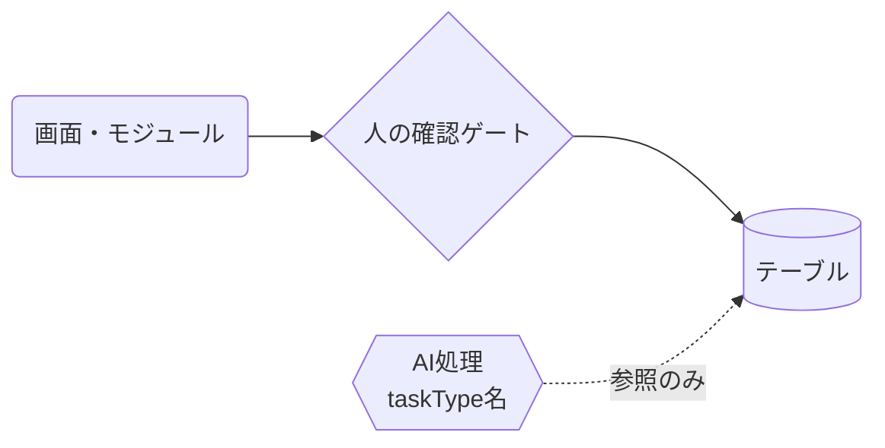
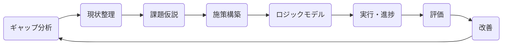

# 図の読み方（全マニュアル共通）

Coe の各マニュアルに出てくる図は、すべて同じ記法で描かれています。
**同じ形は、どの画面のマニュアルでも同じ意味**です。

## 記号の意味

| 形 | 意味 |
|---|---|
| 角丸四角 | 画面・モジュール（人が操作する場所） |
| 円筒 | テーブル（データの保存先） |
| **菱形** | **人の確認・承認ゲート**（ここを通らない限り先に進まない — 無確認の自動登録をしない原則の要） |
| 六角形 | AI処理（横にタスク種別名を併記。すべてゲートウェイ経由） |
| 実線の矢印 | データの流れ（作る・更新する） |
| 点線の矢印 | 参照のみ（読むだけ・変更しない) |

## 位置づけ図

各マニュアルの冒頭には、QCストーリー全体（ギャップ分析 → 現状整理 → 課題仮説 →
施策構築 → ロジックモデル → 実行 → 評価 → 改善）の中で**いま見ている画面がどこか**を
強調した図があります。マスター図は全マニュアル共通で、現在地のハイライトだけが変わります。

## 状態遷移図

ライフサイクルを持つデータ（draft→confirmed、pending→approved など）は
状態遷移図で描きます。**矢印に書かれた操作だけが状態を変えられます**。

## マニュアルの位置づけ

このマニュアルは、①担当者の操作マニュアルであると同時に、
②改修時に「いまの姿」を共有する正本です。リポジトリ内に置かれ、
コードと同じコミットで版管理されるため、画面とマニュアルは常に同じ版です。
（開発の経緯は別途プロジェクトの実装記録に残っています。）
