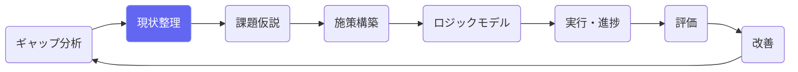
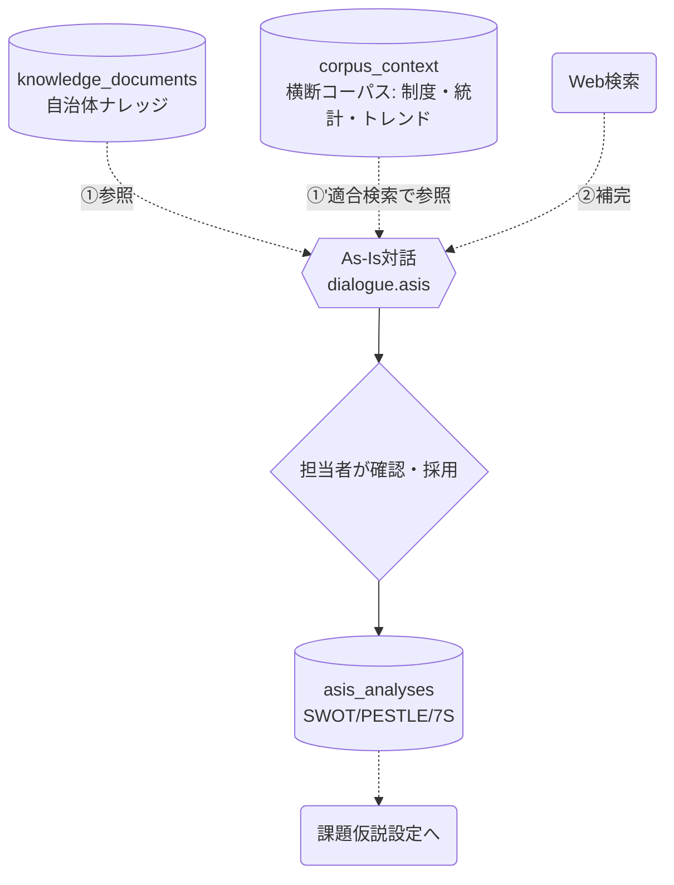

# 現状整理（As-Is）

## ① このメニューは何をするか

SWOT・PESTLE・7S などの枠組みで地域と組織の現状を整理します。
AIとの対話で環境情報を集めながら、外部環境（機会・脅威）と内部環境（強み・弱み）を
構造化し、課題仮説の材料にします。

## ② 位置づけ

## ③ データフロー

対話AIの情報源は **①ナレッジ → ①' 横断コーパス（PESTLE/7Sタグ・地域・人口規模で
適合検索）→ ②Web検索** の順（X7eで①'を追加）。外部環境（O/T）には政策パッケージ・
制度改正・トレンドが、内部環境（S/W）には自地域と全国値の比較が注入されます。
コーパスの環境情報は**期限切れ（effective_until超過）を自動除外** — 改廃済みの制度で
嘘をつきません。

## ④ 状態

分析行は編集自由（承認フローなし）。対話ログは asis 対話として保存されます。

## ⑤ 操作手順

1. 枠組み（SWOT / PESTLE / 7S）を選んで分析を作成
2. AI対話で「この地域の外部環境は？」等を聞きながら要素を集める
   （提案は確認して採用 — 出典つきの情報はそのまま根拠になる）
3. 採用した要素を編集・並べ替えて現状整理を完成させる
4. ギャップ分析の結果と併せて、課題仮説設定の材料になる

> **AIの応答待ちについて** — AIの応答には数十秒〜数分かかることがあります。送信した発言は即座に保存され、画面は「AIが考えています」の表示のまま結果を待ちます（画面を再読み込みしても待ち受けは再開されます）。「AI処理に失敗しました」と出た場合は「🔁 AI処理を再試行」で、発言を再入力せずにやり直せます。

> **対話のコピー** — 各発言の下の 📋 でその発言だけを、画面右上の「対話全体をコピー」で対話全体を
> クリップボードへコピーできます。役割（AI／担当者）と工程の見出しが付いたテキストになるので、
> 庁内資料への引用や、他の担当者への共有にそのまま使えます。

> **AIの返答が空だったとき** — まれに出力が長くなりすぎて途中で切れることがあります。
> その場合は失敗として扱われ、送った発言は残ったまま「🔁 AI処理を再試行」が出ます。
> 発言を打ち直す必要はありません。

## ⑥ 用語と判定基準

- **PESTLE**: 政治/経済/社会/技術/法制度/環境 — 外部環境の分類タグ（コーパスと同語彙）
- **7S**: 戦略/組織/システム/価値観/スキル/人材/スタイル — 内部環境の分類タグ

## ⑦ 実装メモ

- テーブル: asis_analyses ／ 対話は issue_dialogues と同型の対話テーブル
- コーパス接地の適合度: 市区町村一致 > 都道府県 > 人口規模帯 > 全国（しきい値未満は出さない）
- 関連する実装記録: `claude/coe-x7e.md`（コーパス注入）・`claude/coe-govlink.md`

- 対話のAIターンは非同期（migration 055・`lib/ai/asyncTurn.ts`）: 発言保存→202→自己呼び出しでAI処理→画面がポーリング。Amplify の30秒応答上限の対策。検査: `check:asyncturn`

- 対話のコピー: `components/CopyButton.tsx`（navigator.clipboard＋非セキュア環境向けフォールバック）と `lib/ai/transcript.ts`（整形は純粋関数）。検査: `check:copy`

- 出力上限: `dialogueTurn.ts` が `stop_reason=max_tokens` を検出して予算を倍にして引き直す。仮説フェーズは出力が長いためフェーズ別に予算を設定（`MAX_TOKENS_BY_STEP`）。空の返答は保存せず失敗にする。検査: `check:asyncturn`

## ⑧ 更新履歴

- 2026-08-26 v1 — M2 初版（X7eのコーパス接地を反映）
- 2026-08-29 v1.1 — 対話AIターンの非同期化（通信エラー対策・再試行ボタン）
- 2026-08-30 v1.3 — 対話の発言単位／全体のクリップボードコピー
- 2026-08-30 v1.5 — 出力上限で切れた場合の引き直しと、空の返答を失敗として扱う修正
