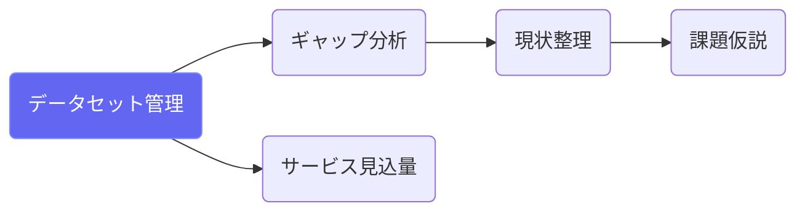
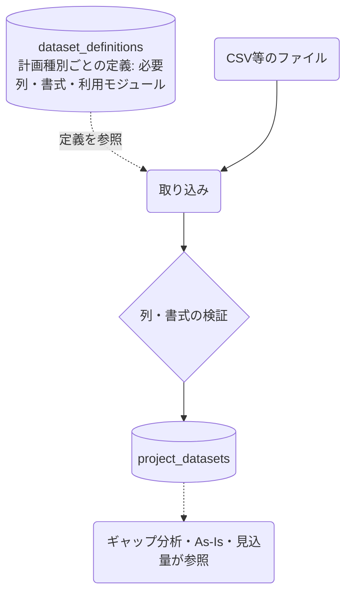

# データセット管理

## ① このメニューは何をするか

計画種別ごとに定義されたデータセット（dataset_definitions — 必要列・書式つき）に
沿って、地域の実データを取り込み・管理します。ギャップ分析・現状整理・
サービス見込量の定量的な土台です。

## ② 位置づけ

## ③ データフロー

## ⑤ 操作手順

1. 計画種別に応じて表示されるデータセット定義を確認（必要列・書式）
2. 手元のデータを定義に合わせて取り込み（検証エラーは修正して再取り込み）
3. 取り込んだデータは各分析画面から自動的に参照される

## ⑥ 用語と判定基準

- **dataset_definitions**: どの計画種別で・どのモジュールが・どんな列を使うかの定義（マスタ）

## ⑦ 実装メモ

- テーブル: project_datasets（プロジェクトの実データ）・dataset_definitions（定義マスタ）
- 関連する実装記録: `claude/coe-govlink.md`

## ⑧ 更新履歴

- 2026-08-26 v1 — M3 初版
