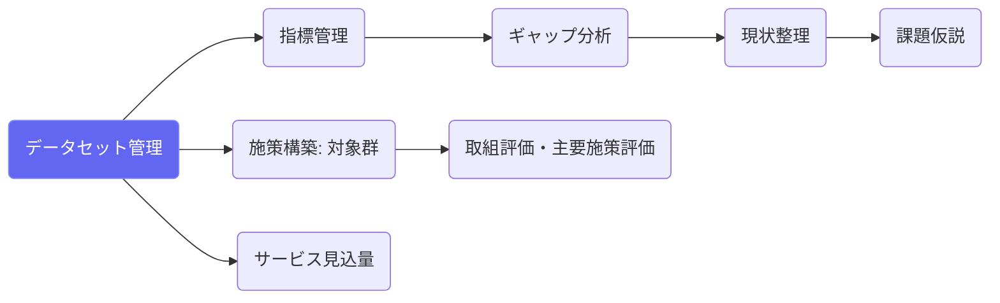
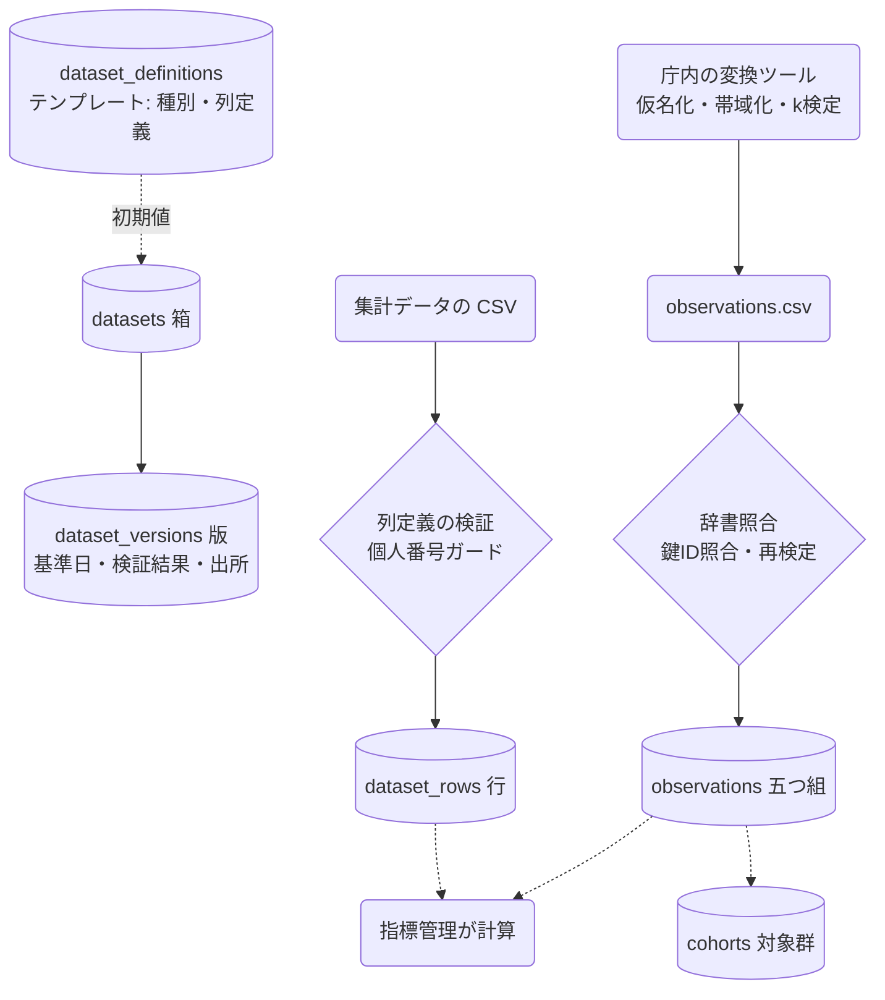

# データセット管理

## ① このメニューは何をするか

計画で使うデータを「**箱**」と「**版**」で管理します。

- **箱** … 何のデータか（名称・種別・列定義・取得方法）。最初に箱を作ります
- **版** … その箱に上げた1回分のデータ。**基準日**（いつ時点のデータか）が必ず付きます

「何のデータを、いつ時点のものとして、いつ上げたか」が履歴として残り、
指標管理はこの版から値を計算します。同じ箱に新しい版を上げても、古い版は消えません
（指標の値が「どの版から計算したか」を参照しているためです）。

箱には2つの種別があります。

| 種別 | 中身 | 例 |
|---|---|---|
| **集計データ** | 表形式の集計値。列定義に沿って行を取り込みます | ニーズ調査の集計、介護保険事業状況報告、人口動態統計 |
| **個票データ** | 一人ひとりの観測。**庁内の変換ツールを通したものだけ**を上げられます | 要介護認定者の個票、健診受診の有無 |

## ② 位置づけ

## ③ データフロー

## ④ 個票データの考え方 — なぜ「対応表」を持たないのか

個票データは、氏名・住所・生年月日・電話・個人番号を**Coe に一切上げません**。
庁内の変換ツールが、宛名番号などの庁内キーから**仮名 ID（sid）**を作り、
年齢や地区を帯域（5歳階級・日常生活圏域）にまとめ、10人未満になる組合せを抑制してから、
その結果だけを Coe に上げます。

仮名 ID は、自治体ごとに1本の**鍵**を使って庁内キーから計算します（HMAC-SHA256）。
同じ人からは常に同じ仮名 ID が出るので、乱数の ID と対応表を庁内で保管する必要がありません。
**守るものは鍵1本**で、紙に書いて封緘し金庫に入れられます。Coe には鍵の識別子（鍵 ID）だけを登録し、
別の鍵で変換した出力は取込を拒否します。仮名 ID から元に戻す復号は存在せず、
通知の宛先を出すときは、現在の宛名一覧を庁内で同じ式に通して照合します。

**Coe 上のデータは、鍵を持つ自治体にとっては「保有個人情報」のままです。**
「クラウドに置いたものは個人情報ではない」という説明はしないでください。

## ⑤ 操作手順

### 集計データを上げる

1. 「＋ 箱を作る」→ 種別「集計データ」→ テンプレートを選ぶ（列定義の初期値が入る）か、列定義を自分で作る
   （各列に **dimension**〔区分〕/ **time**〔時点〕/ **measure**〔数値〕の役割と型を付ける）
2. 任意で「取得方法」（どのシステムのどの帳票か・抽出条件・担当）を記録する
3. 箱を開き「版を上げる」→ **基準日**を入力 → CSV を選ぶ → 検証（列の不足・数値でない値・個人番号様の値は拒否）
4. 版の一覧で件数と検証結果を確認する。誤った版は「無効にする」（削除はしない）

### 個票データを上げる

1. 業務システムの EUC で CSV を出す（**宛名番号の列を含める**）
2. 庁内 PC の変換ツールで、箱・計画・基準日・列のマッピングを指定して変換する
   （出力は observations.csv / aliases.csv / meta.json の zip。ツールはネットワークに接続しません）
3. Coe の箱の画面で zip を上げる → 鍵 ID・辞書の版・k 値を再検定 → 版として保存
4. 「突合確認」で、箱ごとの人数と箱同士の重なりを見る。
   **重なりが 0 なら、キー列の指定違いをまず疑ってください**

### 版を確認・ダウンロードする

1. 一覧から箱を選ぶ → 版が基準日順に並ぶ → 版を選ぶ
2. 版の詳細（件数・検証結果・取込者・この版を使っている指標値）を確認する
3. 「この版をダウンロード」で、上げたものと同じ内容を取得できる（ダウンロードは履歴に残ります）

## ⑥ 用語と判定基準

- **箱（dataset）** … 何のデータかの定義。種別（集計／個票）・列定義・取得方法を持つ
- **版（dataset_version）** … 箱に上げた1回分。基準日・検証結果・出所（鍵 ID・辞書の版）を持つ
- **五つ組（observation）** … 個票の最小単位「誰（sid）／何（属性キー）／いつ（観測時点）／値／出所（版）」
- **属性辞書（attribute_definitions）** … 「何の情報か」の語彙。自由記述型は無い。準識別子には粗化のはしごがある。
  辞書は3層でできている:
  - **共通** … どの分野の計画でも意味が変わらない属性（年齢階級・性別・地区・世帯人数・所得の帯・参加・利用・費用額・状態）
  - **分野パック** … その計画の分野でだけ出る属性。分野パックが無い分野でも、共通＋自団体の属性で個票は扱える
  - **自団体（テナント拡張）** … この自治体で登録した属性。地区の区分のように**値の語彙が自治体ごとに違うもの**は、
    ここで登録して初めて使える（「属性辞書」→「＋ 自団体の属性を登録」）
- **キー種別（key_type_definitions）** … 仮名 ID を作るときの入力になる庁内の番号。どの業務システムのどの番号を使うかは
  自治体と分野で違うので、Coe は決め打ちせず、正規化の型（数字のみ／英数字／英数字＋区切り）だけを用意する。
  共通は宛名番号1件で、あとは「庁内キーの語彙」から登録する。**コードは仮名 ID の計算に入るので登録後は変えられない**
- **準識別子** … 組合せで個人が絞られる属性（年齢階級・性別・圏域・要介護度・世帯類型）。k 検定の対象
- **k 検定** … 準識別子の同じ組合せが k 人（既定 10）以上あることの確認。満たさない行は抑制される
- **鍵 ID** … 庁内の鍵のダイジェスト先頭8桁。鍵そのものではない
- **突合確認** … 箱同士で同じ人が何人重なっているかを数える画面。名寄せが効いているかの健全性確認

## ⑦ 実装メモ

- テーブル: datasets / dataset_versions / dataset_rows（集計の行）/ attribute_definitions（辞書）/
  observations（五つ組）/ subjects / sid_aliases（仮名の別名）/ cohorts / cohort_members / activity_log
- 純関数: `src/lib/dataset/`（正規化・sid 導出・個人番号ガード・コア辞書・粗化・k 検定・五つ組展開）。
  庁内の変換ツールと Coe の取込口が同じコードを使う。**分野に固有の語彙は `src/lib/dataset/domains/` にだけ置く**
  （`check:generic` がコアへの混入を止める）
- 旧 project_datasets は 066 で箱＋版へ移行し、067 で廃止した（ギャップ分析・リネージ・成果物記録は「箱ごとの最新の有効な版」を読む）
- サービス層 `src/lib/dataset/service.ts` — 画面（API）も AI も同じ関数を通り、`activity_log` に同じ形で残る。集計データの版は同期取込（5 MB・50,000 行まで）。1行でも検証に失敗した版は「無効」として記録し、行は取り込まない
- 設計書: `claude/coe-dataset-model.md`（第Ⅰ部）。法的整理: `claude/coe-cohort-etl-plan.md`

## ⑧ 更新履歴

- 2026-09-14 v4 — D2.5: 属性辞書をコア／分野パック／自団体の3層にし、キー種別を登録制にした（migration 068）。分野を固定する要素の排除
- 2026-09-14 v3 — D2: 箱・版の画面と API、集計データの同期取込（列定義検証・個人番号ガード・Shift_JIS）、project_datasets の廃止（067）
- 2026-09-14 v2 — D1: 箱・版・個票（五つ組）・属性辞書・鍵方式（migration 066・lib/dataset・check:dataset）
- 2026-08-26 v1 — M3 初版
