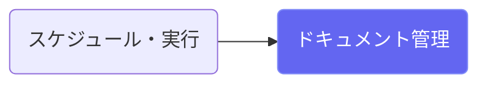
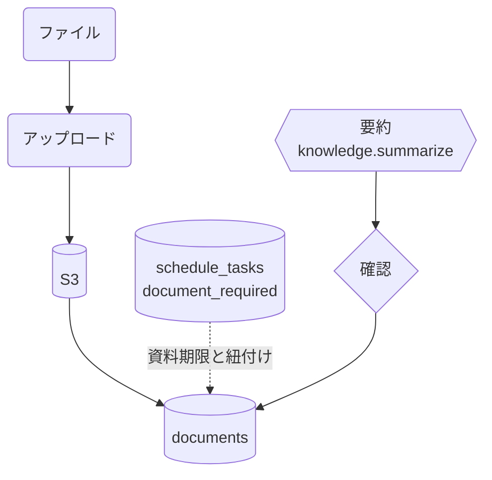

# ドキュメント管理

## ① このメニューは何をするか

会議資料・報告書などのファイルをプロジェクトに紐付けて保管します（S3保存）。
スケジュールタスクの「資料が必要」な期限と結びつき、AI要約で内容確認を支援します。

## ② 位置づけ

## ③ データフロー

## ⑤ 操作手順

1. ファイルをアップロード（タスクに紐付けると資料期限の管理に乗る）
2. 「AI要約」で内容の要点を確認（結果は確認して保存）

## ⑦ 実装メモ

- テーブル: documents（schedule_task_id で工程に紐付け）
- 関連する実装記録: `claude/coe-govlink.md`

## ⑧ 更新履歴

- 2026-08-26 v1 — M3 初版
