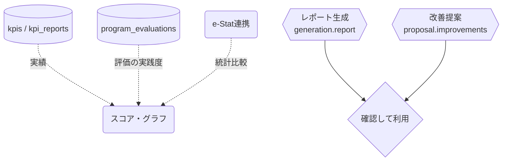

# EBPMダッシュボード

## ① このメニューは何をするか

計画のEBPM成熟度（データ・エビデンス・評価の実践度）をスコアで可視化し、
統計（e-Stat連携）との比較・AIレポート生成・改善提案の入口になるダッシュボードです。

## ② 位置づけ

## ③ データフロー

## ⑤ 操作手順

1. スコアと到達度グラフで計画の現在地を確認
2. 「AIレポート」で状況の文章化、「改善提案」で次の一手の候補を得る（採用は人が判断）

## ⑥ 用語と判定基準

- **到達度**: 基準値からの前進量（全画面統一計算 — achievement.ts）

## ⑦ 実装メモ

- 関連する実装記録: `claude/coe-govlink.md`・`claude/coe-selfeval-fix.md`

## ⑧ 更新履歴

- 2026-08-26 v1 — M3 初版
