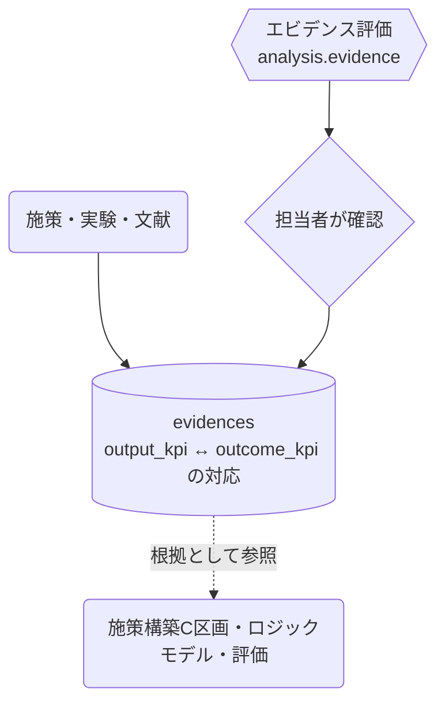

# エビデンス管理

## ① このメニューは何をするか

この計画で参照・蓄積するエビデンス（根拠）を管理します。
アウトプットKPIとアウトカムKPIの対応づけを持ち、AIによるエビデンス評価
（analysis.evidence）で質の確認を支援します。

## ② 位置づけ

## ③ データフロー

## ⑤ 操作手順

1. エビデンスを登録（出典・対応するKPIペア）
2. 「AIで評価」— 研究デザイン・妥当性の観点で確認（結果は確認して採用）
3. 施策構築・ロジックモデルから根拠として参照する

## ⑥ 用語と判定基準

- **エビデンスレベル**: Lv4=RCT / Lv3=対照群あり / Lv2=前後比較 / Lv1=事例（正直判定）
- 横断コーパスの介入エビデンスとは別管理（コーパスは全自治体共有・こちらは計画内）

## ⑦ 実装メモ

- テーブル: evidences（output_kpi_id / outcome_kpi_id）
- 関連する実装記録: `claude/coe-govlink.md`・`claude/coe-ebpm-e2.md`

## ⑧ 更新履歴

- 2026-08-26 v1 — M3 初版
