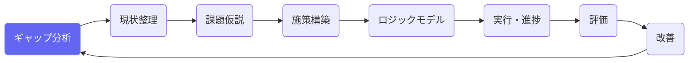
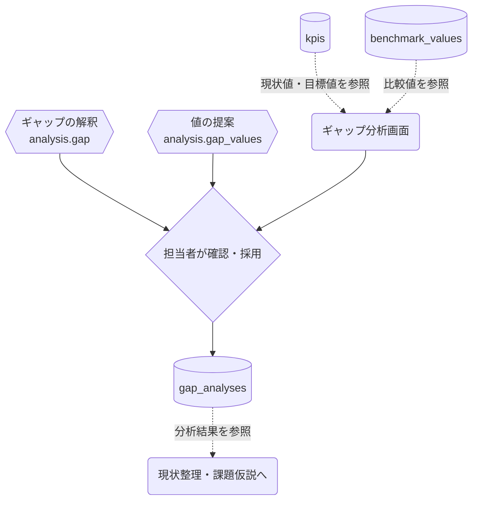

# ギャップ分析

## ① このメニューは何をするか

指標の「あるべき値（目標・ベンチマーク）」と「現状値」の差（ギャップ）を定量化し、
どこに問題があるかを特定します。QCストーリーの入口で、ここで見つけたギャップが
現状整理・課題仮説の出発点になります。

## ② 位置づけ

## ③ データフロー

AIの解釈・値の提案はいずれも**ゲートウェイ経由**で、担当者が確認して採用したものだけが
保存されます（勝手に保存されません）。

## ④ 状態

ギャップ分析の行は作成・編集・削除のみ（承認フローなし）。
分析結果は下流（課題仮説の origin）から参照されます。

## ⑤ 操作手順

1. 指標（KPI）ごとに、あるべき値・現状値・比較対象（全国値・同規模自治体など）を入力
2. 「AIで分析」— ギャップの大きさ・意味の解釈を生成（採用前に内容を確認）
3. 値がわからない場合は「値の提案」— 統計・ベンチマークから候補値を提案
4. 保存したギャップは、現状整理（As-Is）と課題仮説設定の材料として自動的に参照される

## ⑥ 用語と判定基準

- **ギャップ**: あるべき値 − 現状値（指標の向きを考慮）
- **ベンチマーク**: 全国値・県値・同規模自治体の値など比較の基準

## ⑦ 実装メモ

- テーブル: gap_analyses（kpi_id ごとの分析行）
- API: /api/admin/projects/[id]/gap-analysis（CRUD）・ai-analyze・suggest-values
- 関連する実装記録: `claude/coe-govlink.md`

## ⑧ 更新履歴

- 2026-08-26 v1 — M2 初版
