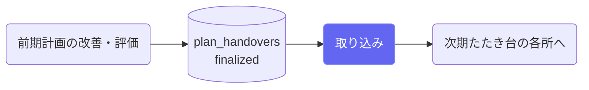
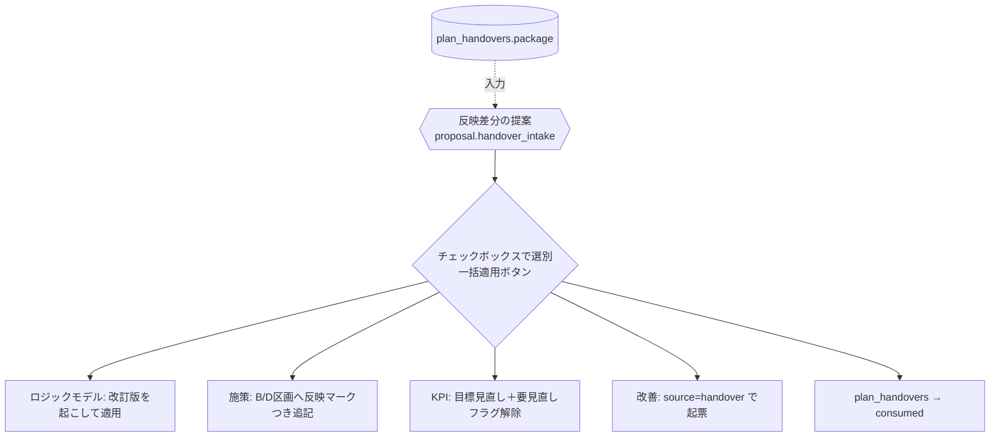

# 前期引き継ぎの取り込み

## ① このメニューは何をするか

前期計画の引き継ぎパッケージ（未達アウトカム・持ち越し改善・真因・図6/7の判断）を、
**AIの反映差分提案 → 担当者の選別 → 一括適用**で次期計画のたたき台へ反映します。
入口は計画概要の「📦 前期からの引き継ぎがあります」バナーです（サイドバーには出ません）。

## ② 位置づけ

## ③ データフロー

すべての適用に「どの引き継ぎ項目から来たか」のリネージが残ります。
**ロジックモデルは現行版を直接触らず改訂版を起こして適用**します。

## ④ 状態

引き継ぎ: finalized（前期で確定）→ consumed（取り込み済み）。

## ⑤ 操作手順

1. バナーから取り込み画面を開き、前期パッケージの内容を確認
2. 「AIで反映差分を提案」→ 提案をチェックボックスで選別（数値の根拠が薄い提案は
   AIが数値を出さない — 勝手な目標値を作らない）
3. 「一括適用」— 選んだものだけが1トランザクションで適用される
4. 前期がCoe外の場合: 報告書ファイルをナレッジ（Tier1）に上げて対話で参照する互換経路

## ⑦ 実装メモ

- 提案サニタイズの正本: `src/lib/plan/handoverIntake.ts`（実在ID検証・件数上限30）
- 関連する実装記録: `claude/coe-pl1.md`

## ⑧ 更新履歴

- 2026-08-26 v1 — M3 初版
