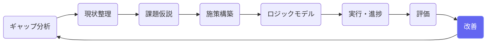
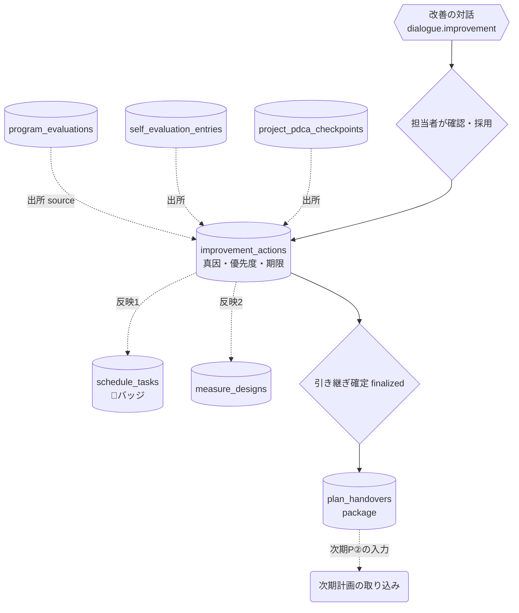
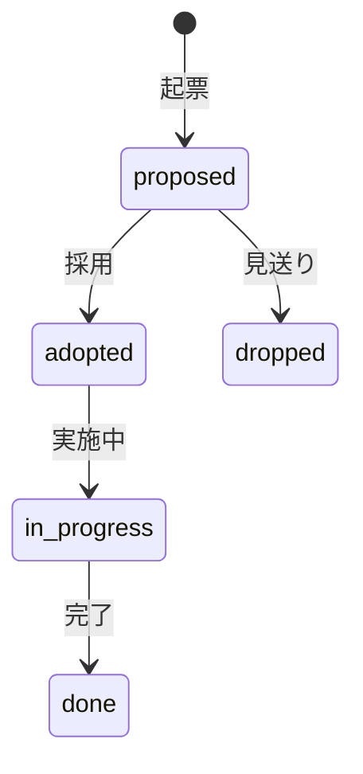

# 改善アクション

## ① このメニューは何をするか

評価・自己評価・チェックポイントから生まれた改善を1か所で管理し、
**どこへ効かせたか**（スケジュール・施策・KPI・次期計画）を1件ずつ記録します。
期末には「📦 次期計画への引き継ぎ」パッケージを作り、次の計画のたたき台へつなぎます。

## ② 位置づけ

## ③ データフロー

## ④ 状態

引き継ぎパッケージ: draft → finalized（内容固定）→ consumed（次期計画で取り込み済み）。

## ⑤ 操作手順

1. 評価・自己評価の画面から、または直接起票（source と真因が記録される）
2. 優先度・担当・期限を設定 → 採用 → 実施
3. 「スケジュールへ反映」等で反映先を記録（スケジュール側に 🔧 バッジが付く）
4. 期末: carry_over（次期へ持ち越し）を付けて「次期計画への引き継ぎ」を確定（finalized）
5. 次期計画がたたき台複製（P①）されると自動で結線され、取り込み画面（P②）の入力になる

> **AIの応答待ちについて** — AIの応答には数十秒〜数分かかることがあります。送信した発言は即座に保存され、画面は「AIが考えています」の表示のまま結果を待ちます（画面を再読み込みしても待ち受けは再開されます）。「AI処理に失敗しました」と出た場合は「🔁 AI処理を再試行」で、発言を再入力せずにやり直せます。

## ⑥ 用語と判定基準

- **期限超過**: 期限を過ぎて done/dropped でないもの（isOverdue）
- **carry_over**: 期内に完了しない改善を次期へ申し送るフラグ（引き継ぎパッケージに入る）

## ⑦ 実装メモ

- テーブル: improvement_actions（source 5種・反映先FK 4系統・plan_handover_id）・plan_handovers
- 関連する実装記録: `claude/coe-ca-p4.md`・`coe-ca-p5.md`・`claude/coe-pl1.md`（P①P②）

- 対話のAIターンは非同期（migration 055・`lib/ai/asyncTurn.ts`）: 発言保存→202→自己呼び出しでAI処理→画面がポーリング。Amplify の30秒応答上限の対策。検査: `check:asyncturn`

## ⑧ 更新履歴

- 2026-08-26 v1 — M2 初版
- 2026-08-29 v1.1 — 対話AIターンの非同期化（通信エラー対策・再試行ボタン）
