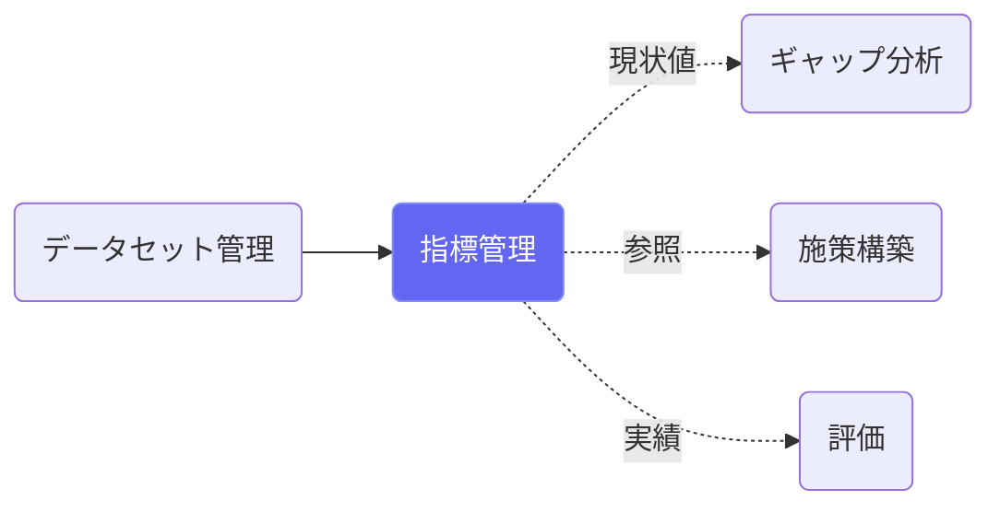
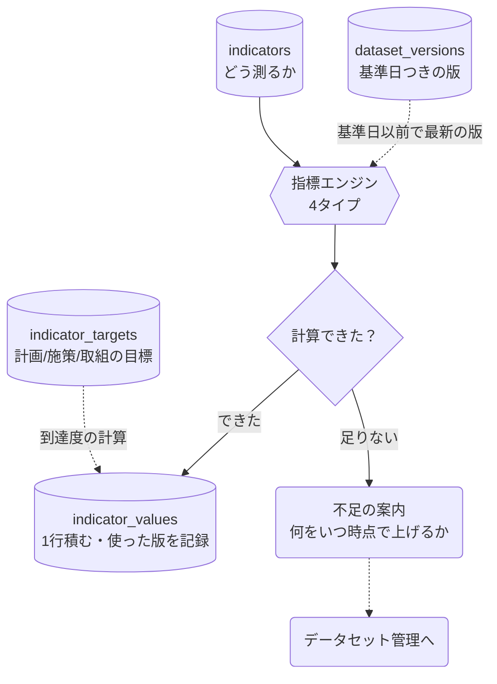

# 指標管理

## ① このメニューは何をするか

**「どう測るか」の正本**です。データセット管理に上げたデータを見て値を出し、
その値を**基準日つきの履歴**として積みます。

計画の KPI も、主要施策・取組の目標も、すべてここで一元管理します。
同じ現状値を KPI にも施策指標にも手で入れる二重入力は無くなりました。

## ② 位置づけ

## ③ データフロー

## ④ 指標の4つのタイプ

| タイプ | 何をするか | 必要なデータ |
|---|---|---|
| **手入力** | 人が値を入れる（計算しない） | 不要 |
| **集計型** | 1つのデータセットの行を絞って集計（合計・平均・件数・割合・値そのまま） | 集計データ・個票データのどちらでも |
| **経年比較型** | 同じ人の同じ属性を2時点で比べ、「維持・改善」の割合を出す | **個票データのみ** |
| **クロス集計型** | 複数の属性を突合し、条件をすべて満たす人を数える | **個票データのみ** |
| **計算式型** | 他の指標の値から計算（四則のみ） | 参照する指標の同じ基準日の値 |

> **経年比較型・クロス集計型が個票を必要とする理由**: 集計されたデータでは、
> どの行が同じ人のものか分かりません。2時点を比べる・複数の属性を重ねる、
> のどちらも「同じ人」を追えることが前提です。これが個票を五つ組
> （誰・何・いつ・値・出所）で持つ理由そのものです。

## ⑤ 操作手順

1. 「＋ 指標を追加」→ 名前・単位・目標値を入れる
2. どうやって値を出すかを選ぶ（迷ったら**手入力**で登録しておき、データが揃ってから変更できます）
3. 計算型を選んだら、どのデータセットの・どの列（または属性）を・どう集計するかを指定
4. 「最新値の確認」→ 基準日を決めて実行 → 値が履歴に積まれる
5. 複数まとめて取るときは「複数の指標の最新値を取得」→ 基準日と対象を選んで実行

## ⑥ 用語と判定基準

- **基準日（as_of）**: 「いつ時点の値か」。計算した日ではありません。
  計算には、**その基準日以前で最も新しい有効な版**を使います。使った版は履歴に残ります
- **最新値**: 履歴のうち基準日が最も新しい1行（同じ基準日なら、計算・入力が新しい方）
- **同じ基準日で計算し直しても上書きしません。** 新しい版を上げて値が変わったことを
  あとから追えるようにするためです
- **不足**: 計算できないときは、どのデータセットを・いつ時点で上げればよいかを構造で返します
  （版が無い／属性が無い／列が無い／人数が少なすぎる／参照する指標の値が無い の5種）
- **人数が少なすぎる場合**: 個票を数える指標は、分母が5人を下回ると値を出しません
  （個人が特定されうるため）

## ⑦ 実装メモ

- 設定の検証・計算式の解析は `src/lib/indicator/spec.ts`（純関数。画面・API・AI が同じものを通る）
- 版の選択と計算は `src/lib/indicator/engine.ts`。**値を履歴に積むのはエンジンではなく**
  サービス層（`src/lib/indicator/service.ts` の `recordValue`）
- 画面・一括取得・ギャップ分析・AI の対話は、どれも同じサービス関数を通り、
  `activity_log` に同じ形で残る（`via` だけが違う）
- 計算式型は任意の式評価器を持たない。`{ind:指標ID}`・数値・`+ - * / ( )` だけを読む
  構文限定のパーサ
- 権限はデータセット管理（`dataset_manager`）と同じ区分で見る
- 関連する実装記録: `claude/coe-d3.md`（一元化）・`claude/coe-d4.md`（エンジンと画面）
- 設計: `claude/coe-dataset-model.md` §9・§10-1

## ⑧ 更新履歴

- 2026-09-14 v1 — D4 初版（指標エンジン・一覧・設定・履歴・一括取得・ギャップ分析との接続）
