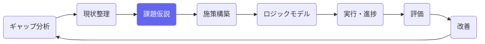
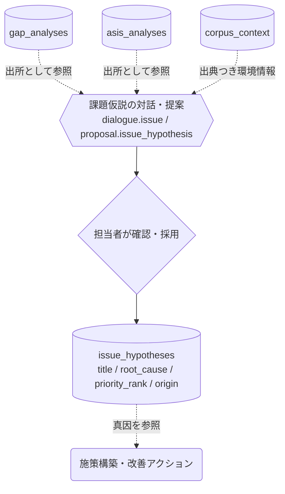

# 課題仮説設定

## ① このメニューは何をするか

ギャップ分析・現状整理の結果から「なぜそのギャップが生じているのか」の
課題仮説を立て、**真因（root cause）**まで掘り下げます。
ここで特定した真因が施策構築の出発点になり、評価・改善でも
「改善が真因に対応しているか」を見る基準になります。

## ② 位置づけ

## ③ データフロー

仮説には **origin（どのギャップ・どの現状整理から出たか）と source_text（出典つき原文）**
が記録され、後から「なぜこの課題だと考えたか」を遡れます。

## ④ 状態

仮説行は編集自由。priority_rank で優先順位を付けます（NULL=未設定）。

## ⑤ 操作手順

1. 「AI提案」または対話で、ギャップ・現状整理から課題仮説の候補を出す
2. 候補を確認して採用（採用前に内容・出典を確認 — 勝手に保存されない）
3. 仮説ごとに「なぜ？」を繰り返して root_cause（真因）を記入
4. 優先順位を付ける — 上位の仮説から施策構築（EBPM）へ進む

> **AIの応答待ちについて** — AIの応答には数十秒〜数分かかることがあります。送信した発言は即座に保存され、画面は「AIが考えています」の表示のまま結果を待ちます（画面を再読み込みしても待ち受けは再開されます）。「AI処理に失敗しました」と出た場合は「🔁 AI処理を再試行」で、発言を再入力せずにやり直せます。

## ⑥ 用語と判定基準

- **課題仮説**: ギャップの原因についての検証可能な仮説
- **真因**: 掘り下げの終点。施策はこの真因に効かせる（対症療法との区別）

## ⑦ 実装メモ

- テーブル: issue_hypotheses（origin/source_text で trace 可能）・issue_dialogues（対話ログ）
- 関連する実装記録: `claude/coe-govlink.md`・`claude/coe-ca-p1.md`

- 対話のAIターンは非同期（migration 055・`lib/ai/asyncTurn.ts`）: 発言保存→202→自己呼び出しでAI処理→画面がポーリング。Amplify の30秒応答上限の対策。検査: `check:asyncturn`

## ⑧ 更新履歴

- 2026-08-26 v1 — M2 初版
- 2026-08-29 v1.1 — 対話AIターンの非同期化（通信エラー対策・再試行ボタン）
