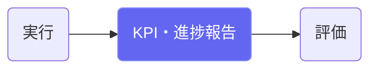
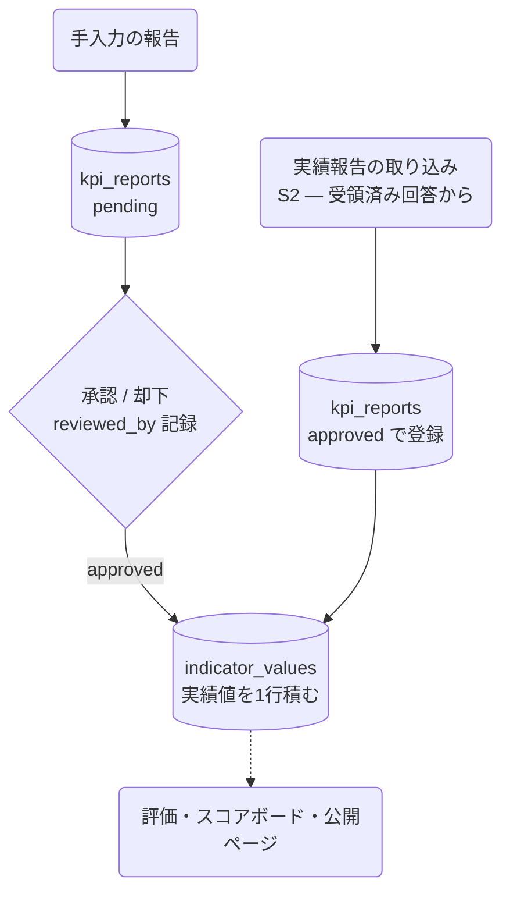

# KPI・進捗報告

## ① このメニューは何をするか

KPIの実績値の報告と承認を管理します。**承認された報告だけが KPI の現在値を更新**し、
評価・スコアボード・公開ページに反映されます（勝手に現在値は変わりません）。

## ② 位置づけ

## ③ データフロー

## ④ 状態

報告: pending → approved（実績値を記録）/ rejected。

> **069 以降**: 承認しても「現在値」という1つの欄を上書きするのではなく、
> **いつ時点の値か（基準日）を持つ履歴に1行積みます**。同じ基準日で入れ直しても
> 前の値は消えず、どちらがいつ・誰の・どの経路（画面／取り込み／AI）で入ったかが残ります。
> 画面に出る「現在値」は、その履歴の最新の1行です。
実績報告依頼（C①）からの取り込みは、受領＋取り込みクリックが人の確認にあたるため
approved で登録されます（reported_by に依頼IDが残る）。

## ⑤ 操作手順

1. 期間・値・コメントを入れて報告（または実績報告依頼の回収で自動起票）
2. 承認者が内容を確認して承認 → 実績値が指標の履歴に積まれる
3. 却下した報告は履歴に残る（実績値は積まれない）

## ⑥ 用語と判定基準

- **到達度**: 基準値からの前進量（承認後の現在値で全画面統一計算）

## ⑦ 実装メモ

- 承認時の実績値の記録は /api/admin/kpi-reports/[id] の PATCH が行い、
  指標管理のサービス層（`lib/indicator/service.ts` の `recordValue`）を通る。
  画面・取り込み・AI のどれでも同じ関数を通り、`activity_log` に同じ形で残る
- 関連する実装記録: `claude/coe-govlink.md`・`claude/coe-s2.md`（取り込み経路）

## ⑧ 更新履歴

- 2026-08-26 v1 — M3 初版（S2の取り込み経路を反映）
- 2026-09-14 v2 — D3: KPI を指標管理に統合。現在値の上書きをやめ、基準日つきの履歴に
