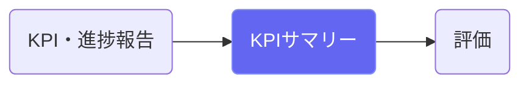
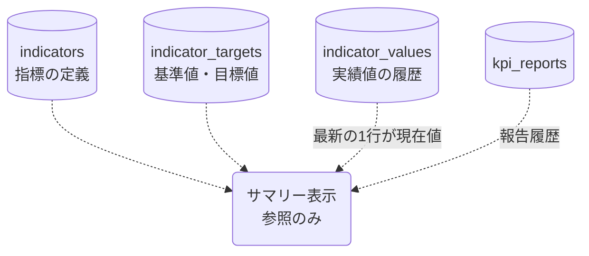

# KPIサマリー

## ① このメニューは何をするか

全KPIの現在地（到達度・軌道）と報告履歴を一覧するサマリー画面です。
三層アウトカム（短期/中間/長期）ごとに整理され、評価前の全体把握に使います。

## ② 位置づけ

## ③ データフロー

## ⑤ 操作手順

1. 層ごとにKPIの到達度と直近の報告を確認
2. 気になる指標はKPI・進捗報告へ（この画面は閲覧専用）

## ⑥ 用語と判定基準

- **到達度**: 基準値からの前進量（目標の向きを考慮・全画面統一計算）
- **現在値**: 実績値の履歴のうち、**基準日が最も新しい1行**の値。
  同じ基準日で入れ直したときは、計算・入力が新しい方を採ります

## ⑦ 実装メモ

- 到達度計算の正本: `src/lib/stats/achievement.ts`
- 関連する実装記録: `claude/coe-govlink.md`

## ⑧ 更新履歴

- 2026-08-26 v1 — M3 初版
- 2026-09-14 v2 — D3: KPI を指標管理に統合（目標と実績値が別の表に分かれた）
