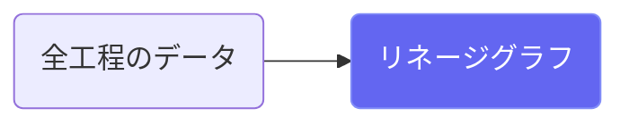
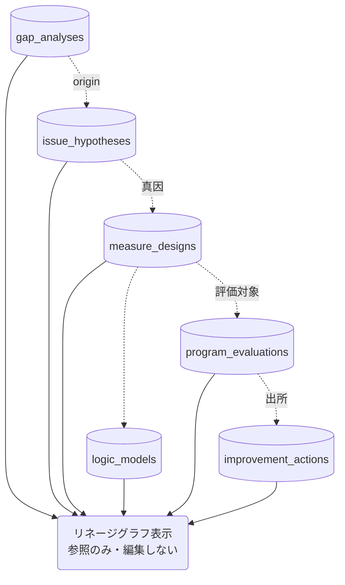

# リネージグラフ

## ① このメニューは何をするか

「ギャップ → 課題仮説（真因）→ 施策 → ロジックモデル → 評価 → 改善」の
**つながり（リネージ）をグラフで可視化**します。どの施策がどの真因から出て、
どんな評価を受け、どの改善につながったか — QCストーリーの一貫性を点検する画面です。

## ② 位置づけ

## ③ データフロー

## ⑤ 操作手順

1. グラフでつながりを俯瞰（切れている鎖＝出所のない施策・評価されていない施策が見える）
2. ノードから各画面へ移動して修正する（この画面自体は閲覧専用）

## ⑥ 用語と判定基準

- **リネージ**: データの出自と流れ。各テーブルの origin / source / FK 列が実体

## ⑦ 実装メモ

- 関連する実装記録: `claude/coe-ca-audit.md`（トレーサビリティ監査）

## ⑧ 更新履歴

- 2026-08-26 v1 — M3 初版
