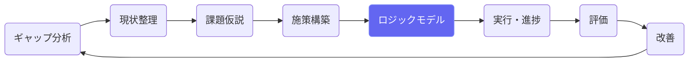
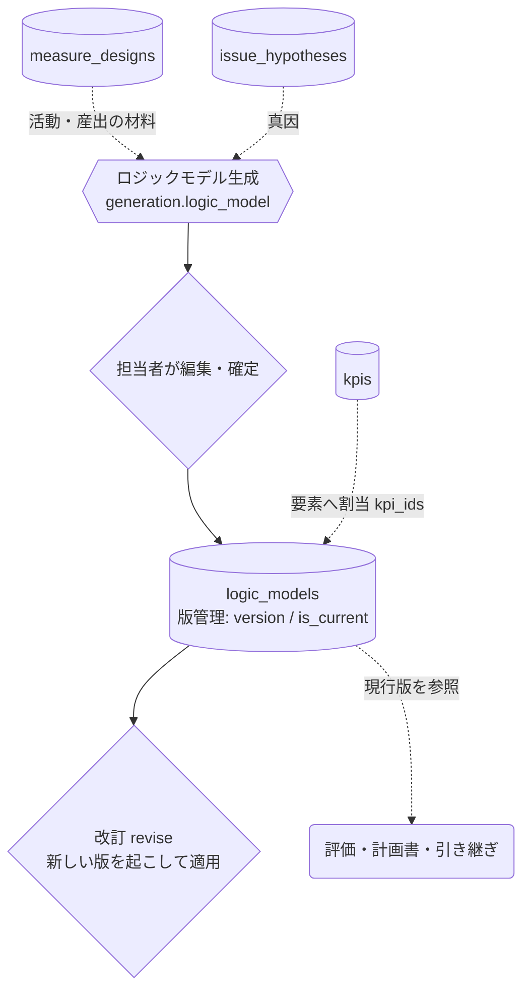
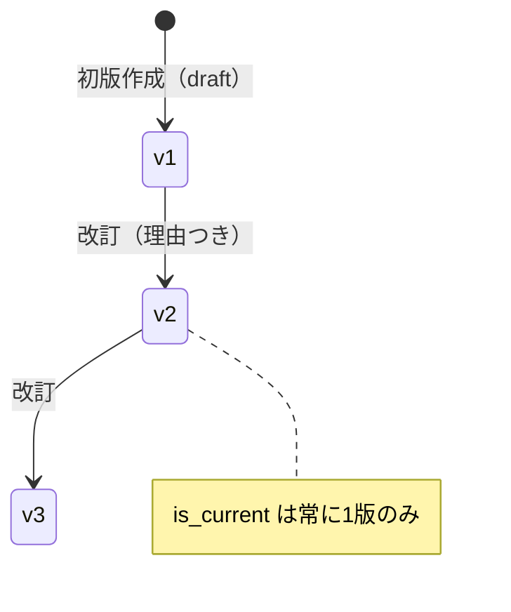

# ロジックモデル

## ① このメニューは何をするか

投入 → 活動 → 産出 → 初期 / 中間 / 長期アウトカムの因果仮説を図で設計します。
要素にはKPIを割り当てられ（三層アウトカムとの対応）、**版管理**により
「いつ・なぜ変えたか」が残ります。評価（図6/図7）と次期計画への引き継ぎの土台です。

## ② 位置づけ

## ③ データフロー

**現行版は直接上書きしない** — 変更は改訂（revise）で新しい版を起こし、
revision_reason に理由を残して適用します（L5 の定石。引き継ぎ取り込みも同じ経路）。

## ④ 状態

## ⑤ 操作手順

1. 「AIで生成」— 課題仮説・施策から因果チェーンの下書きを作る（確認して採用）
2. 要素の編集・因果エッジ（矢印）の張り替え・要素へのKPI割り当て
3. 変更が必要になったら**改訂** — 理由を書いて新しい版を起こす（履歴が残る）
4. 評価画面は現行版の要素・KPI対応を参照して「どの成果の評価か」を特定する

## ⑥ 用語と判定基準

- **三層アウトカム**: 短期（概ね1年・図6で年次評価）/ 中間（2〜5年・図7で計画期間評価）/
  長期（計画期間超・スコアボードで常時監視）
- **因果エッジ**: 要素間の「これがこうなるはず」という仮説の矢印。評価の判断経路が検証する

## ⑦ 実装メモ

- テーブル: logic_models（要素セクション7種＋edges JSONB・版管理列）
- 検査: check:logicmodel（要素構造）・check:consistency・check:diff・check:revise（版複製の全列運搬）
- 関連する実装記録: `claude/coe-lm-l1.md`〜`coe-lm-l5.md`・`claude/coe-logicmodel-audit.md`

## ⑧ 更新履歴

- 2026-08-26 v1 — M2 初版
