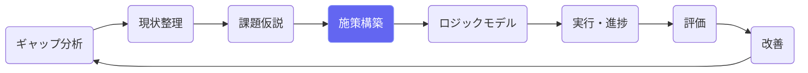
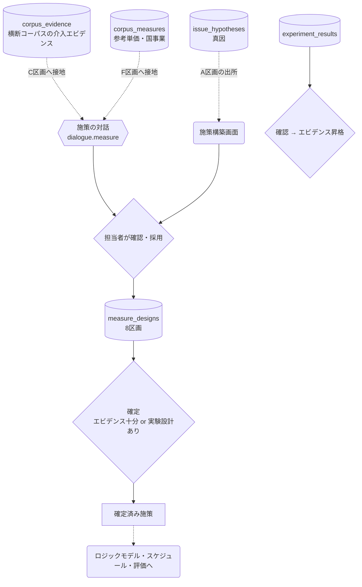
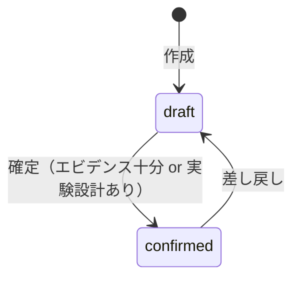
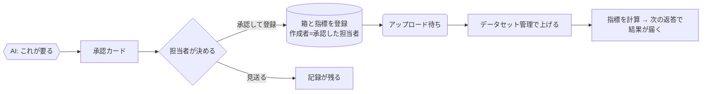

# 施策構築（EBPM）

## ① このメニューは何をするか

課題仮説の真因に効かせる施策を、**8つの区画**（A出所 / B定義 / Cエビデンス /
D実験設計 / E指標 / Fコスト / G実行 / H管理）で設計します。
エビデンスに基づく設計（EBPM）を対話AIが支援し、**エビデンスが足りない施策は
実験設計を添えない限り確定できない**仕組みで質を担保します。

## ② 位置づけ

## ③ データフロー

対話のC区画にはコーパスのエビデンス（効果量・95%CI・エビデンスレベルつき）、
F区画には類似施策の単価分布・財政効果率が接地されます（2件未満は表示しない）。

## ④ 状態

実験結果（experiment_results）は draft → confirmed → **promote（エビデンス昇格）**。
昇格は confirmed のもののみ（機械的に強制）。

## ⑤ 操作手順

1. 課題仮説（真因）を選んで施策を作成 — A区画に出所が記録される
2. 対話AIとB〜G区画を埋める（介入内容・対象・エビデンス・実験設計・SPO指標・コスト・体制）
3. エビデンスが不足なら D区画で実験設計（RCT/準実験/前後比較・検出力の目安）を書く
4. **確定** — 確定済み施策だけがスケジュール生成・評価・実績報告の対象になる
5. 実施後、実験結果を記録 → 確認 → エビデンスに昇格（次の計画の根拠になる）

> **AIの応答待ちについて** — AIの応答には数十秒〜数分かかることがあります。送信した発言は即座に保存され、画面は「AIが考えています」の表示のまま結果を待ちます（画面を再読み込みしても待ち受けは再開されます）。「AI処理に失敗しました」と出た場合は「🔁 AI処理を再試行」で、発言を再入力せずにやり直せます。

## ⑤-2 データが足りないとき — 提案 → 承認 → 待機 → 再開（D6）

対話のAIは、登録済みの指標とその最新値を**毎ターン見ています**。
必要な値が無いときは推測で話を進めず、次のどちらかをします。

| AIがすること | 何が起きるか |
|---|---|
| 登録済みの指標の値を求める | サーバがターンの後に計算し、**次の返答の冒頭に値が届きます**（このターンでは返りません） |
| 足りないデータセット・指標を**提案する** | 対話の下に**承認カード**が出ます |

**承認するまで何も作られません。** カードには「承認すると何が作られ、何が作られないか」が
書いてあります（箱を作っても、データはまだ入りません）。

- **見送った提案も消えません。** 何を提案され、なぜ採らなかったかが残ります
- **待機はブロックではありません。** データを待っている間も対話は続けられます
- 再開は2つの経路があり、**どちらでも同じ結果になります**
  （担当者が「上げました」と伝える／データセット管理で版が有効になる）。
  どちらも同じ処理を通るので、伝え忘れても上げた時点で再開します
- 承認して作られた箱と指標は、**画面から作ったものと同じ**です。
  あとから指標管理・データセット管理で編集も削除もできます。
  違いは操作履歴の経路が「AI対話（担当者が承認）」になることだけです
- 個票データの箱は対話からは提案できません（庁内の変換ツールと鍵の運用が要るため）

対話の中に点線で囲まれた青い行が出ることがあります。これは**担当者の発言ではなく**、
サーバが差し込んだ記録（計算結果・不足の案内・承認や取込の記録）です。

## ⑥ 用語と判定基準

- **エビデンスレベル**: Lv4=RCT明記 / Lv3=対照群あり / Lv2=前後比較 / Lv1=事例（正直判定）
- **SPO指標**: 構造（Structure）/ 過程（Process）/ 成果（Outcome）の三層指標
- **確定条件**: エビデンス十分（sufficient）または実験設計あり — どちらも無い施策は確定不可

## ⑦ 実装メモ

- テーブル: measure_designs（8区画・milestones/risks/experiment は JSONB）・experiment_results
- 検査: `npm run check:measure` `npm run check:expresults`
- 関連する実装記録: `claude/coe-ebpm-e1.md`〜`coe-ebpm-e5.md`

- 対話のAIターンは非同期（migration 055・`lib/ai/asyncTurn.ts`）: 発言保存→202→自己呼び出しでAI処理→画面がポーリング。Amplify の30秒応答上限の対策。検査: `check:asyncturn`

## ⑧ 更新履歴

- 2026-08-26 v1 — M2 初版
- 2026-08-29 v1.1 — 対話AIターンの非同期化（通信エラー対策・再試行ボタン）
- 2026-09-14 v1.2 — D6（指標の文脈注入・提案 → 承認 → 登録 → アップロード待ち → 再開。
  承認するまで何も作らない。承認した箱と指標は画面から作ったものと同じ）
