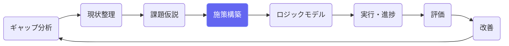
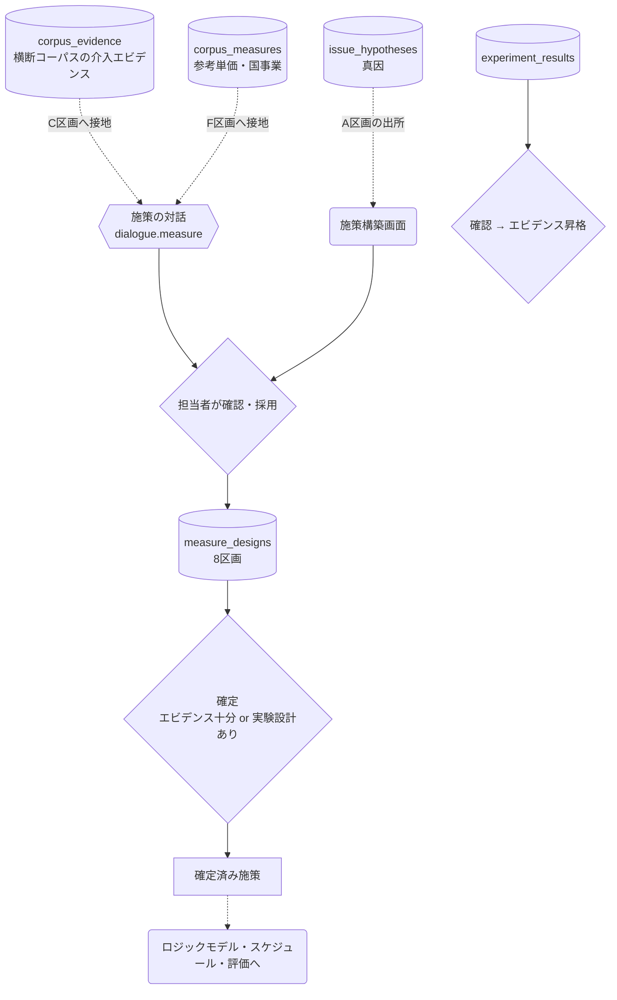
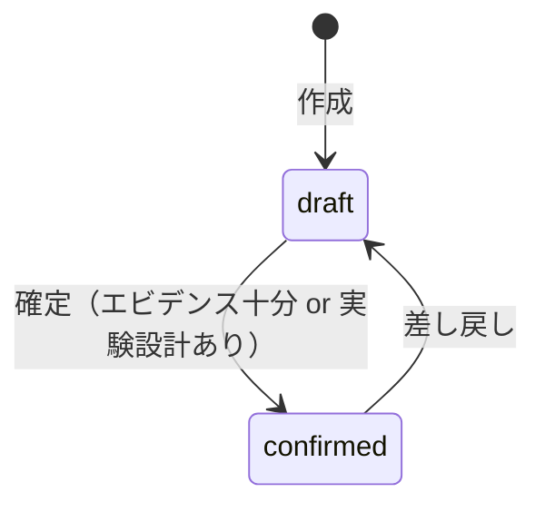

# 施策構築（EBPM）

## ① このメニューは何をするか

課題仮説の真因に効かせる施策を、**8つの区画**（A出所 / B定義 / Cエビデンス /
D実験設計 / E指標 / Fコスト / G実行 / H管理）で設計します。
エビデンスに基づく設計（EBPM）を対話AIが支援し、**エビデンスが足りない施策は
実験設計を添えない限り確定できない**仕組みで質を担保します。

## ② 位置づけ

## ③ データフロー

対話のC区画にはコーパスのエビデンス（効果量・95%CI・エビデンスレベルつき）、
F区画には類似施策の単価分布・財政効果率が接地されます（2件未満は表示しない）。

## ④ 状態

実験結果（experiment_results）は draft → confirmed → **promote（エビデンス昇格）**。
昇格は confirmed のもののみ（機械的に強制）。

## ⑤ 操作手順

1. 課題仮説（真因）を選んで施策を作成 — A区画に出所が記録される
2. 対話AIとB〜G区画を埋める（介入内容・対象・エビデンス・実験設計・SPO指標・コスト・体制）
3. エビデンスが不足なら D区画で実験設計（RCT/準実験/前後比較・検出力の目安）を書く
4. **確定** — 確定済み施策だけがスケジュール生成・評価・実績報告の対象になる
5. 実施後、実験結果を記録 → 確認 → エビデンスに昇格（次の計画の根拠になる）

## ⑥ 用語と判定基準

- **エビデンスレベル**: Lv4=RCT明記 / Lv3=対照群あり / Lv2=前後比較 / Lv1=事例（正直判定）
- **SPO指標**: 構造（Structure）/ 過程（Process）/ 成果（Outcome）の三層指標
- **確定条件**: エビデンス十分（sufficient）または実験設計あり — どちらも無い施策は確定不可

## ⑦ 実装メモ

- テーブル: measure_designs（8区画・milestones/risks/experiment は JSONB）・experiment_results
- 検査: `npm run check:measure` `npm run check:expresults`
- 関連する実装記録: `claude/coe-ebpm-e1.md`〜`coe-ebpm-e5.md`

## ⑧ 更新履歴

- 2026-08-26 v1 — M2 初版
