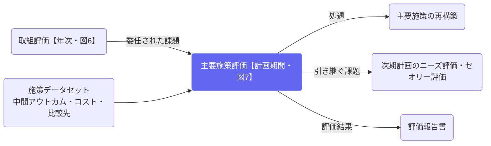

# 主要施策評価（計画期間）

## ① このメニューは何をするか

**主要施策ごと**に、**一計画期間**の評価（図7）を行います。実施のタイミングは
**中間アウトカム指標（No.8）が確定した時点**で、指標ごとに設定した評価時点に従います。

入力は、取組評価（図6）から**委任された課題**です。評価の目的は3つあります。

1. **次期計画における処遇を決める** — 継続・改変・統合・廃止の別。
   ここで決めた処遇が、改善メニュー「主要施策の再構築」の出発点になります。
2. **次期計画の主要施策形成での効果性向上** — 中間アウトカム指標の改善につながる論点を残します。
3. **次期のニーズ評価・セオリー評価への引き継ぎ** — 主要施策の改善だけでは解消できない、
   計画全体のロジックモデルの見直しが要る課題を引き継ぎます。

## ② 位置づけ

## ③ 評価の流れ（図7）

1. **中間アウトカムの達成**（No.8・自動提示）
2. **初期アウトカムとの関係** — 未達のとき。取組評価の結果を並べて、連鎖のどこで
   途切れたかを見極めます
3. **委任された課題の整理** — 課題ごとに「この評価で扱った」「次期計画へ引き継ぐ」を記録します
   （委任が無ければ飛ばされます）
4. **コストと効率性** — 単位コスト（No.15）・インプット（No.3）・年度別の事業費。
   比較先（ベンチマーク）を登録していれば**他団体比較**の工程が入り、
   費用対効果指標（No.16）があれば費用対効果の工程も入ります
5. **次期計画での処遇** — 継続・改変・統合・廃止（理由必須）
6. **次期計画への引き継ぎ** — 計画レベルの課題の記入と、引き継ぎ事項

保存は下書き。**承認すると**判定に使った指標の実績が凍結され、以後の実績更新では動きません。

## ④ よくある質問

- **他団体比較の工程が出てこない** — 比較先が未登録です。施策構築（EBPM）の指標に
  比較先（全国平均・県平均・人口同規模平均など）を**出典つきで**登録すると出ます。
- **委任された課題が出てこない** — 取組評価（図6）の最後で委任された課題だけが並びます。
  取組評価を先に回してください。
- **処遇を決めたのに現行計画が変わらない** — 変わりません。処遇は次期計画のためのもので、
  現行計画の施策データ（施策構築の内容）は評価では書き換えない設計です。
