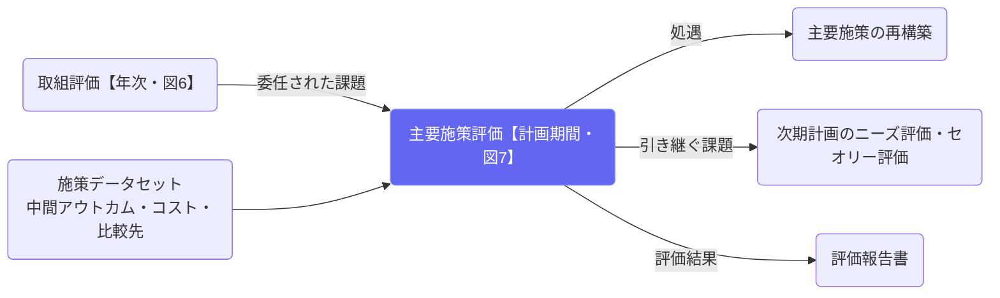

# 主要施策評価（計画期間）

## ① このメニューは何をするか

**主要施策ごと**に、**一計画期間**の評価（図7）を行います。実施のタイミングは
**中間アウトカム指標（No.8）が確定した時点**で、指標ごとに設定した評価時点に従います。

入力は、取組評価（図6）から**委任された課題**です。評価の目的は3つあります。

1. **次期計画における処遇を決める** — 継続・改変・統合・廃止の別。
   ここで決めた処遇が、改善メニュー「主要施策の再構築」の出発点になります。
2. **次期計画の主要施策形成での効果性向上** — 中間アウトカム指標の改善につながる論点を残します。
3. **次期のニーズ評価・セオリー評価への引き継ぎ** — 主要施策の改善だけでは解消できない、
   計画全体のロジックモデルの見直しが要る課題を引き継ぎます。

## ② 位置づけ

## ③ フロー全体図（図7）

  
この評価の目的

  <ol>
    <li><b>次期計画における処遇を決める</b> — 継続・改変・統合・廃止の別。改善メニュー「主要施策の再構築」の出発点になる</li>
    <li><b>次期の主要施策形成で効果性を上げる</b> — 中間アウトカム指標の改善につながる論点を残す</li>
    <li><b>次期のニーズ評価・セオリー評価へ引き継ぐ</b> — 計画全体のロジックモデルの見直しが要る課題を渡す</li>
    <li><b>エビデンスを獲得し記録に残す</b> — 判定に使った指標と実績を凍結する</li>
  </ol>

  

工程 1 ／ 中間アウトカムの達成自動提示

    
中間アウトカム指標は目標値に達しましたか？

    
中間アウトカム指標（No.8）。この指標の評価時点が、そのままこの評価の実施タイミングです。

  

<b>達した</b>工程3へ

<b>達していない</b>工程2で連鎖を確かめる

  
↓

  

工程 2 ／ 初期アウトカムとの関係

    
未達の要因は、取組（初期アウトカム）の側にありますか？

    
この施策の<b>取組評価（図6）の結果を一覧</b>で示します。取組も未達／取組は達成しているが中間に結びつかない／外部要因／評価が不足、から選びます。

  
↓

  

工程 3 ／ 委任された課題委任があるとき

    
取組評価から委任された課題を、この評価でどう扱いますか？

    
課題ごとに「この評価で扱った」か「次期計画へ引き継ぐ」かを記録します。行は消さず、どの評価で決着したかが残ります。

  
↓

  

工程 4 ／ コストと効率性

    
投入した人員と予算は、得られた成果に見合っていましたか？

    
単位コスト（No.15）・インプット（No.3・執行率）と、計画期間の年度別事業費。

  
↓

  

工程 4-2 ／ 他団体との比較比較先があるとき

    
同規模の団体と比べて、この施策の水準はどうでしたか？

    
登録した比較先（全国平均・県平均・人口同規模平均など）との比較表。<b>比較先には出典が必須</b>です。

  
↓

  

工程 4-3 ／ 費用対効果No.16 があるとき

    
費用対効果（費用便益）はどう評価しますか？

    
費用対効果指標（No.16）と積算内訳。

  
↓

  

結論 1 ／ 次期計画での処遇再構築へ

    
継続する／改変する／他施策と統合する／廃止する

    
継続以外は理由が必須です。ここで決めた処遇が、改善メニュー「主要施策の再構築」の出発点になります。<b>現行計画の施策データ（施策構築の内容）は評価では書き換えません。</b>

  
↓

  

結論 2 ／ 次期計画への引き継ぎニーズ・セオリー評価へ

    
計画全体のロジックモデルの見直しが要る課題はありますか？ ＋ 引き継ぎ事項

    
記入した課題は、次期計画策定時のニーズ評価・セオリー評価の入力になります。

## ④ 評価の流れ（図7）

1. **中間アウトカムの達成**（No.8・自動提示）
2. **初期アウトカムとの関係** — 未達のとき。取組評価の結果を並べて、連鎖のどこで
   途切れたかを見極めます
3. **委任された課題の整理** — 課題ごとに「この評価で扱った」「次期計画へ引き継ぐ」を記録します
   （委任が無ければ飛ばされます）
4. **コストと効率性** — 単位コスト（No.15）・インプット（No.3）・年度別の事業費。
   比較先（ベンチマーク）を登録していれば**他団体比較**の工程が入り、
   費用対効果指標（No.16）があれば費用対効果の工程も入ります
5. **次期計画での処遇** — 継続・改変・統合・廃止（理由必須）
6. **次期計画への引き継ぎ** — 計画レベルの課題の記入と、引き継ぎ事項

保存は下書き。**承認すると**判定に使った指標の実績が凍結され、以後の実績更新では動きません。

## ⑤ よくある質問

- **他団体比較の工程が出てこない** — 比較先が未登録です。施策構築（EBPM）の指標に
  比較先（全国平均・県平均・人口同規模平均など）を**出典つきで**登録すると出ます。
- **委任された課題が出てこない** — 取組評価（図6）の最後で委任された課題だけが並びます。
  取組評価を先に回してください。
- **処遇を決めたのに現行計画が変わらない** — 変わりません。処遇は次期計画のためのもので、
  現行計画の施策データ（施策構築の内容）は評価では書き換えない設計です。
