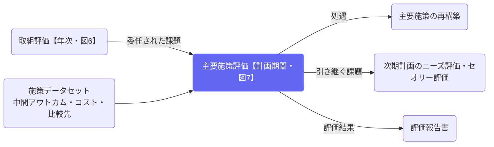

# 主要施策評価（計画期間）

## ① このメニューは何をするか

**主要施策ごと**に、**一計画期間**の評価（図7）を行います。実施のタイミングは
**中間アウトカム指標（No.8）が確定した時点**で、指標ごとに設定した評価時点に従います。

入力は、取組評価（図6）から**委任された課題**です。評価の目的は3つあります。

1. **次期計画における処遇を決める** — 図E1の判定（記号列）から報告書No.1〜9・反映ルート
   （A校正／B再設計／C移植／D構造）・**標準処遇**が機械的に定まります。担当者の裁量は
   「標準処遇と異なる処遇を採る理由（理由書H4）を書く」ところにだけあります（comply or explain）。
   ここで決めた処遇が、改善メニュー「次期計画への反映」（様式G1・G4）の出発点になります。
2. **次期計画の主要施策形成での効果性向上** — 中間アウトカム指標の改善につながる論点を残します。
3. **次期のニーズ評価・セオリー評価への引き継ぎ** — 主要施策の改善だけでは解消できない、
   計画全体のロジックモデルの見直しが要る課題を引き継ぎます。

## ② 位置づけ

## ③ フロー全体図（図E1 ＝ fig7e1）

  
この評価の目的

  <ol>
    <li><b>次期計画における処遇を決める</b> — 判定→報告書No.→ルート→標準処遇を機械的に導き、異なる処遇には理由書（H4）</li>
    <li><b>次期の主要施策形成で効果性を上げる</b> — 中間アウトカム指標の改善につながる論点を残す</li>
    <li><b>次期のニーズ評価・セオリー評価へ引き継ぐ</b> — 計画全体のロジックモデルの見直しが要る課題を渡す</li>
    <li><b>エビデンスを獲得し記録に残す</b> — 判定に使った指標・比較の段・財政効果の実績を凍結する</li>
  </ol>

  

工程 1 ／ 目標到達自動提示

    
成果（中間アウトカム）は目標値に達しましたか？

    
中間アウトカム指標（No.8）の期末実績と目標値。<b>達した＝A、達していない＝B</b>。

  

<b>達した（A）</b>工程3へ

<b>達していない（B）</b>工程2へ

  
↓

  

工程 2 ／ 接近自動提示（3か年傾向）

    
未達ですが、目標値に近づいていますか？

    
主たる中間アウトカムの年度別実績、直近3点の傾きで判定（単年のブレに引きずられない）。実績が2点なら<b>暫定判定</b>、1点以下ならシステム判定なし（担当者が根拠を書いて選ぶ）。<b>近づいている＝C、近づいていない＝I（→報告書No.1へ直行）</b>。

  
↓

  

工程 3 ／ 起因

    
成果の変化は、初期アウトカム（施策の働き）に起因しますか？

    
<b>初期アウトカムの年次履歴</b>（各年度の取組評価・達否・実行起因／論理起因の型）が因果判断の唯一の根拠。ここで<b>実際に行った比較の方法（比較の段A〜D）</b>も記録します。<b>起因する＝E、起因しない＝D</b>。

  

<b>起因する（E）</b>工程4bへ

<b>起因しない（D）</b>工程4aへ

  
↓

  

工程 4a ／ 別要因の再現可能性

    
別の要因を特定でき、人為的に再現可能ですか？

    
<b>再現可能＝G</b>（成功要因転用・No.3／7）、<b>不明＝F・再現不能＝H</b>（外部要因依存・寄与不明・No.2／6）。

  

工程 4b ／ 財政効果率自動算定

    
投入した人員と予算は適切でしたか（財政効果率100%以上か）？

    
寄与経路ごとの<b>期末実績（累計・円）</b>を入れると、財政効果÷事業費（計画期間累計・人件費按分込み）で算定。<b>100%以上＝J、未満＝K</b>。推計不能なら判定保留（処遇せず測定課題Ⅳ）。

  
↓

  

工程 5 ／ 委任された課題委任があるとき

    
取組評価から委任された課題を、この評価でどう扱いますか？

    
課題ごとに「この評価で扱った」か「次期計画へ引き継ぐ」かを記録します。

  
↓

  

工程 6 ／ 他団体との比較比較先があるとき

    
同規模の団体と比べて、この施策の水準はどうでしたか？

    
登録した比較先との比較表。<b>比較先には出典が必須</b>です。

  
↓

  

工程 7 ／ 次期計画での処遇反映へ

    
報告書No.から定まる標準処遇を、この施策の処遇（事務局案）としますか？

    
標準処遇のとおり／<b>異なる処遇（理由書H4が必須。未記入だと承認できない）</b>／判定保留・適用除外のため処遇を行わない。<b>現行計画の施策データは評価では書き換えません。</b>

  
↓

  

工程 8 ／ 次期計画への引き継ぎニーズ・セオリー評価へ

    
計画全体のロジックモデルの見直しが要る課題はありますか？ ＋ 引き継ぎ事項

    
記入した課題は、次期計画策定時のニーズ評価・セオリー評価の入力になります。

## ④ 判定と報告書の対応（記号列 → 報告書No. → ルート）

| 記号列 | No. | 報告書 | ルート |
|---|---|---|---|
| B→I | 1 | 施策中止・再設計 | B 再設計 |
| B→C→D→F/H | 2 | 外部要因依存 | B 再設計 |
| B→C→D→G | 3 | 成功要因転用（発見） | C 移植 |
| B→C→E→K | 4 | 未達・効率改善 | D 構造 |
| B→C→E→J | 5 | 順調接近・継続 | A 校正 |
| A→D→F/H | 6 | 達成・寄与不明（再配分） | B 再設計 |
| A→D→G | 7 | 達成・成功要因転用 | C 移植 |
| A→E→K | 8 | 達成・効率化（圧縮・統廃合） | D 構造 |
| A→E→J | 9 | 達成・継続（最良） | A 校正 |

問いが揃わなければ**判定保留**（記号列は「A→E→?」のように途中まで表示）。どのルートにも進まず、
処遇は行いません。測定課題Ⅳとして記録し、次期に判定可能となる測定設計を計画に書き込みます。

保存は下書き。**承認すると**判定・比較の段・財政効果の実績と、判定に使った指標の実績が凍結されます。
標準処遇と異なる決定処遇に理由書（H4）が無いと承認できません。

## ⑤ 施策側で先に用意しておくもの（施策データセット「判定の前提」）

- **自然体推計値（ベースライン）** — 中間・初期アウトカム指標ごと。X＝期末実績−この値（目標値との差ではない）
- **寄与経路と事前推計** — どの変数を通じて財政効果が生じるか（経路別推計式）と、計画時の推計額
- **適用除外** — 法定必須・セーフティネット（廃止対象としない）／スモールN（比較の段Dの方法で評価）

これらは計画時の前提なので施策側（施策構築のデータセット）に置き、評価が書く値
（判定・処遇・実際に行った比較の段・財政効果の実績）は評価側に置きます。

## ⑥ よくある質問

- **工程4bが「推計不能」になる** — 寄与経路が未定義か、期末実績・事業費が未入力です。
  施策データセット「判定の前提」で経路を定義し、年度別事業費を入れてください。
- **工程2で「システム判定なし」と出る** — 主たる中間アウトカムの年度別実績が1点以下です。
  3か年の傾向は判定できないため、根拠を書いて担当者が選びます（報告書に「単年判断」と注記）。
- **他団体比較の工程が出てこない** — 比較先が未登録です。出典つきで登録すると出ます。
- **委任された課題が出てこない** — 取組評価（図6）の最後で委任された課題だけが並びます。
- **承認できない** — 標準処遇と異なる処遇に理由書（H4）が未記入です。評価一覧の「理由書未記入」表示を確認してください。
- **処遇を決めたのに現行計画が変わらない** — 変わりません。処遇は次期計画のためのもので、
  現行計画の施策データは評価では書き換えない設計です。
