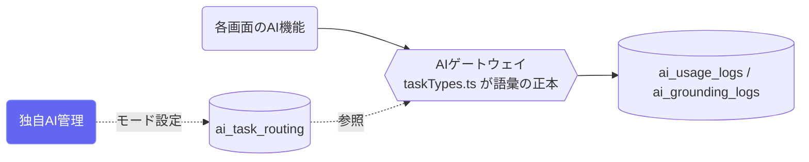

# 独自AI管理（Ordo運営）

## ① このメニューは何をするか

CoeのすべてのAI呼び出し（ゲートウェイ経由）の**タスク種別ごとの動作モード**と
利用状況を管理する運営画面です。コーパス接地の段階導入（shadow → assist → primary）を
種別ごとのダイヤルで制御します。

## ② 位置づけ

## ③ 動作モード

- **claude**: 従来どおり（接地なし）
- **shadow**: 裏でコーパス検索・記録のみ（利用者に出さない — 品質計測用）
- **assist**: コーパス検索結果をプロンプトへ注入
- **primary**: 独自AI主体（未実装 — 設定しても assist として安全側に動く）

未知のタスク種別はゲートウェイが**実行時に拒否**します（語彙は taskTypes.ts に
追加してから使う — check:aigateway が乖離を検出）。

## ⑤ 操作手順

1. ルーティングタブで種別ごとのモードを切り替え（段階導入のダイヤル）
2. 利用状況タブでトークン消費・呼び出し回数・接地の利用状況を確認

## ⑥ 用語と判定基準

- **接地（grounding）**: 承認済みコーパスを適合度つきで検索しAIの入力に注入すること。
  適合度しきい値未満・2件未満の統計は出さない

## ⑦ 実装メモ

- ゲートウェイの正本: `src/lib/ai/gateway.ts`・語彙: `src/lib/ai/taskTypes.ts`
- 関連する実装記録: `claude/coe-ownai-x1x2.md`〜`coe-ownai-x6.md`

## ⑧ 更新履歴

- 2026-08-26 v1 — M3 初版
