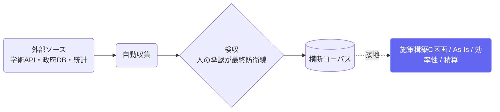
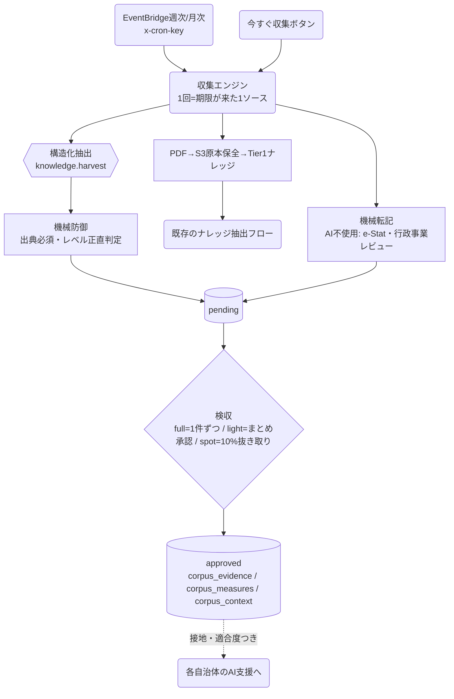

# コーパス管理（Ordo運営）

## ① このメニューは何をするか

全自治体の施策構築・現状整理を支える**横断コーパス**（介入エビデンス・
財政/単価参照・SWOT環境情報の3種別）を集め、検収し、閲覧する運営画面です。
自動収集（X7）はどれだけ自動化しても**pending 投入まで** — 承認は必ず人が行います。

## ② 位置づけ

## ③ データフロー

## ④ タブ構成と状態

- **検収**: pending → approved / rejected。一括承認（重複疑いは件数を明示して確認）・
  dup_of（類似度0.6以上）は並べて表示 — **自動では絶対に落とさない**
- **ナレッジ抽出**: PDF由来の抽出候補（proposed）を選別して intake
- **同意管理**: 自治体供出データの許諾状態
- **🛰 自動収集**: ソース一覧（**license_note 未記入は有効化不可**）・収集履歴・
  30日サマリー（新規候補・検収待ち・APIコスト・失敗run ⚠バッジ）
- **📚 コーパス一覧**: approved の3種別切替・分野チップ・全文検索・CSV出力（閲覧専用）

## ⑤ 操作手順（検収スループット設計）

1. 自動収集タブで稼働確認（失敗runの⚠、検収待ち残数）
2. 検収タブで review_mode に応じて処理:
   full=内容・出典・レベルを1件ずつ / light=サンプル10件＋統計サマリーでまとめ承認 /
   spot=ランダム10%目視→問題なければ残りをまとめ承認
3. 検収残が2,000件を超えたソースは巡回が自動停止（溜めすぎ防止）
4. コーパス一覧で棚卸し（接地に使われた回数も見える）

## ⑥ 用語と判定基準

- **source_key**: 冪等キー（`webseed:auto:<adapter>:<安定ID>`）— 再収集しても二重登録されない
- **エビデンスレベル**: rct明記=Lv4 / 対照群あり=Lv3 / 前後比較=Lv2 / 事例=Lv1。
  抄録のみでRCTを名乗る行は本文確認まで1段保守的に
- **財政効果率**: 財政効果額（年換算）÷ 事業費 — 効率性評価（第5階層）と同一定義

## ⑦ 実装メモ

- 収集エンジンの正本: `src/lib/corpus/harvest/`（adapters/engine/types）・接地は `src/lib/corpus/`
- 検査: check:harvest（191件）・check:corpus・check:corpusmatch
- 関連する実装記録: `claude/coe-x7a.md`〜`coe-x7e.md`・`coe-ownai-x3.md`〜`x6.md`

## ⑧ 更新履歴

- 2026-08-26 v1 — M2 初版（X7a〜X7e を反映。JAGES収集の未解決は coe-x7e.md 参照）
