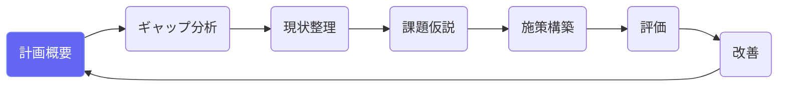
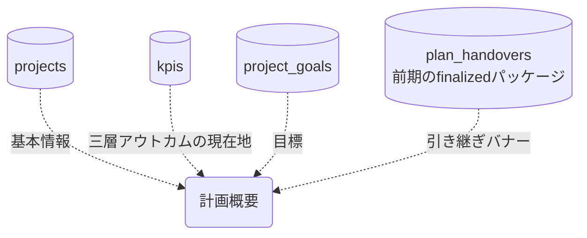

# 計画概要

## ① このメニューは何をするか

計画（プロジェクト）の基本情報・目標・KPIの現在地を一覧するダッシュボードです。
前期計画から複製されたたたき台には「📦 前期からの引き継ぎがあります」バナーが出て、
取り込み画面（P②）への入口になります。

## ② 位置づけ

## ③ データフロー

## ⑤ 操作手順

1. 基本情報（標題・期間・目的）と目標・KPIを確認
2. KPIの current は KPI・進捗報告の承認で更新される（ここでは閲覧）
3. 前期からの引き継ぎバナーが出ていれば「取り込みへ」— AI提案を選別して一括適用

## ⑥ 用語と判定基準

- **到達度**: 基準値からの前進量（全画面統一計算）
- **たたき台**: P①で前期から複製された計画（実績・過程は持ち込まれない）

## ⑦ 実装メモ

- 関連する実装記録: `claude/coe-govlink.md`・`claude/coe-pl1.md`

## ⑧ 更新履歴

- 2026-08-26 v1 — M3 初版
