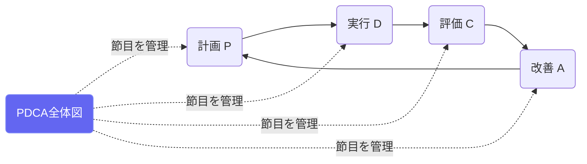
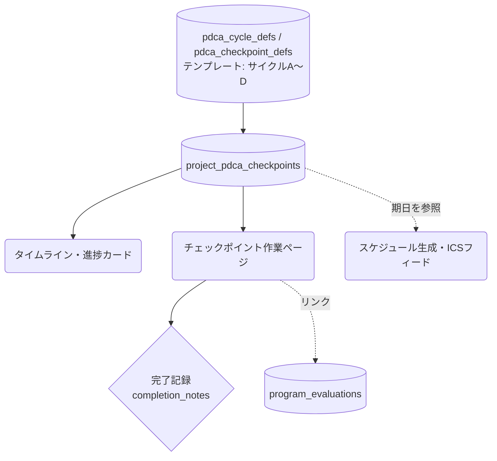

# PDCAサイクル全体図

## ① このメニューは何をするか

計画期間全体のPDCAの節目（チェックポイント）をタイムラインで見渡し、
各節目の作業ページ（評価・自己評価・改善への入口）に進むダッシュボードです。
進捗カードは**日数の経過率とチェックポイント完了率を並べて表示**し、
時間だけ過ぎて節目が消化できていないずれを可視化します。

## ② 位置づけ

## ③ データフロー

## ④ 状態

チェックポイント: upcoming → in_progress → completed（/ skipped）。
完了時に評価レコードとのリンク（linked_evaluation_ids）と完了メモが残ります。

## ⑤ 操作手順

1. タイムラインで次の節目と期日を確認（進捗カードで経過率と完了率のずれを見る）
2. 節目を開いて指示（instructions）に沿って作業 — 図6/図7評価・自己評価などへの入口
3. 作業を終えたら完了記録（メモから改善アクションを起票できる）

## ⑥ 用語と判定基準

- **サイクルB/C**: 年2回（6月・10月）の年次評価（図6） ／ **サイクルD**: 計画期間評価（図7）
- **チェックポイント完了率**: completed ÷ 全体（skipped除外）

## ⑦ 実装メモ

- 進捗カードの完了率表示は S1 で追加（PdcaDashboardClient）
- 関連する実装記録: `claude/coe-ca-p1.md`・`claude/coe-s1.md`

## ⑧ 更新履歴

- 2026-08-26 v1 — M3 初版（S1の完了率併記を反映）
