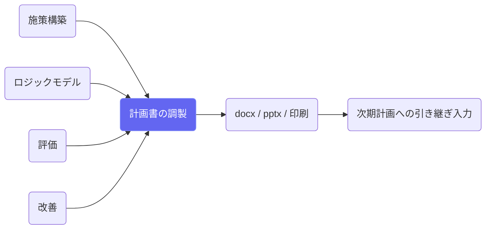
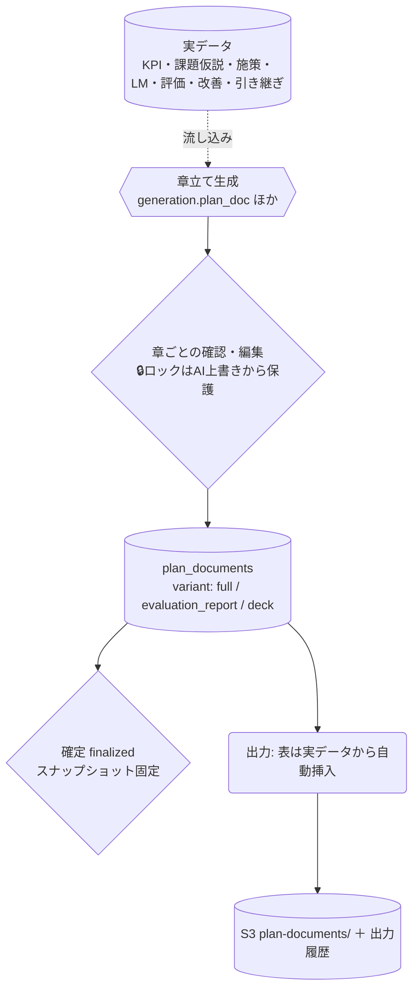

# 計画書の調製

## ① このメニューは何をするか

3種類の文書を実データから調製します:
**📄 計画書**（P③ — 定型7章・docxを本編/簡易版/概要版で出力）、
**📊 評価報告書**（A① — 定型6章・docx＋印刷/PDF保存。確定すると次期P②の入力になる）、
**🎤 説明資料**（P④ — 住民向けpptx・ノート欄に読み原稿）。

## ② 位置づけ

## ③ データフロー

**数値の表（KPI・施策一覧・工程・達成状況・改善一覧）はAIに書かせず、
出力のたびに実データから自動挿入**します。

## ④ 状態

各文書: draft ⇄ finalized（確定中は編集・生成・リライト不可）。
章/スライドごとの locked=true は生成・リライトの対象外（手動編集の保護）。

## ⑤ 操作手順

1. タブで文書を選ぶ → 「🪄 章立てを起こす」（1〜2分）
2. 章を開いて編集・🔒ロック・AIリライト（指示つき）→ 💾保存
3. ✅確定（評価報告書の確定版は次期計画の取り込みP②の入力になる）
4. 出力 — 計画書: 本編/簡易版/概要版 docx ／ 評価報告書: docx＋🖨印刷 ／
   説明資料: pptx（PowerPointのノート欄に読み原稿）

## ⑥ 用語と判定基準

- **簡易版**: 章要約＋KPI表＋施策一覧 ／ **概要版**: A4見開き2〜4頁
- **読み原稿**: 話し言葉・1枚45〜60秒（≒250〜350字）— ナレーション動画化の入力形式

## ⑦ 実装メモ

- 正本: `src/lib/plan/document.ts`（章・保護）・`docx.ts`・`deck.ts`・`pptx.ts`・`evalData.ts`
- 様式は標準プレースホルダ（踏襲様式の提供後に layout を差し替え）
- 関連する実装記録: `claude/coe-pl2.md`・`coe-pl3.md`・`coe-pl4.md`

## ⑧ 更新履歴

- 2026-08-26 v1 — M3 初版（PL2〜PL4を反映）
