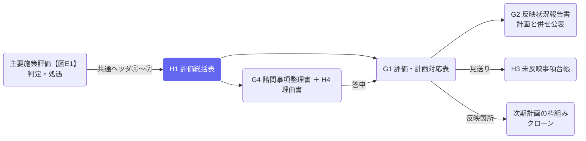

# 次期計画への反映（収束工程）

## ① このメニューは何をするか

期末評価（主要施策評価・図E1）の結果を**次期計画へ流し込む工程**（Act・収束工程）の様式を扱います。

- **転記ゼロ**: H1・G1・G4①〜⑦・G2 は、主要施策評価が保存した判定（記号列→報告書No.→ルート→標準処遇）と
  処遇から自動生成します。手で起こすのは理由書（H4）・G4⑧〜⑫・反映箇所（G1-8）・注記だけです
- **表はAIに書かせず、実データから組む**。判定はここで作り直しません
- **現行計画の施策データ（施策構築の内容）は書き換えません**

## ② 位置づけ

## ③ タブと工程

| タブ | 様式 | 収束工程 | 状態 |
|---|---|---|---|
| H1 評価総括表 | 全指標セットを1行1セットで一覧化し、施策単位の処遇案に束ねる（全様式の転記元） | 段階1 | 実装済み |
| G1 評価・計画対応表 | 「行き先のない報告書」と「根拠のない施策」の両方向照合（停止条件） | 段階1〜4 | 実装済み（照合は警告） |
| G4 諮問事項整理書（＋H4） | 報告書1件につき1葉。①〜⑦は自動、⑧〜⑫と理由書を手入力 | 段階2 | 実装済み |
| G2 反映状況報告書 | 標準処遇に対する採否（採用・一部採用・不採用）と理由を公表 | 段階5 | 実装済み |
| H3 未反映事項台帳 | 見送った知見を登録し、年次評価で必ず再上程 | 段階6 | 実装済み |

## ④ H1 評価総括表の読み方

- **1行＝1指標セット**（アウトプット No.6 → 初期アウトカム No.7 → 中間アウトカム No.8）。取組ごとに1セット。
  取組が無い施策は施策レベルの指標で1セット
- **達否** ○=達成 ×=未達 －=判定不能（最新実績か目標値が無い）。**◎**=主たる中間アウトカム
- **評価過程→報告書No.** は主要施策評価の保存値（承認済み＞レビュー中＞下書き）。未承認は【暫定】。
  判定保留は「B→? → 判定保留」のように途中までの記号列で示す
- **事業費／財政効果率** は施策計（セットへの按分はしない）
- **注記**（H1-9）の自動分: 適用除外／判定保留／主要施策評価が未実施／旧フローの評価／No.7・No.8未設定／
  初期アウトカムの取組間共有（課題Ⅳ）。手入力の注記は G1 と同じフェーズで追加
- 「H1をWordで出力」で横向きの docx を出します（S3 にも保存）

## ⑤ G1・G4・G2・H3 の使い方

- **G1**: 報告書（＝施策ごとの最新の主要施策評価）1件が1行。判定・ルート・標準処遇・決定処遇・理由書の有無は自動。
  「記入 ▼」で **G1-6 決定処遇**（処遇決定会議／答申による修正。履歴に残る）と **G1-8 反映箇所**
  （次期施策へ／章・総論へ／不採用・理由）を記入。次期計画（クローン）があれば施策を選べ、無ければ施策No.・章・頁を記入。
  照合（両方向）の結果を上部に表示。**対応漏れが残れば計画案を決裁に回せない**（クローン改修までは警告表示）。
  理由書が過半なら決定ルールの改定を検討
- **G4（＋H4）**: 左で報告書を選ぶ。①〜⑦は自動。⑧判断4軸・⑨関係機関の意見・①諮問番号等・⑪資源の異動・答申を記入。
  **H4 理由書**は標準処遇と異なる事務局案のとき必須（未記入だと主要施策評価を承認できない）。
  ⑩諮問事項はルートから自動（B=ア・イ・ウ／C=ア・オ／D=ア・カ／A=エ）。「G4をWordで出力」で1葉の docx
- **G2**: 決定は「標準処遇に対する採否」。既定は 標準どおり＝採用／異なる＝一部採用。不採用は担当者が選ぶ。
  理由は理由書の要旨。例外の件数を表示（過半→ルール改定の検討）。計画と併せて公表する docx
- **H3**: 見送った知見を「事項・理由・再検討期日・再上程の条件」で登録。状態は 見送り→再上程→採用／取り下げ（理由必須）。
  再検討期日が到来した見送りは赤で表示（年次評価で必ず再上程）

## ⑥ よくある質問

- **判定が「－（データなし）」** — その施策の主要施策評価がまだありません。C評価 → 主要施策評価（計画期間）で「図7評価を開始」してください
- **判定が「旧フローのため判定なし」** — 図E1以前（fig7v2）の評価です。fig7e1 で再評価すると判定が入ります
- **財政効果率が算定不能** — 施策データセット「判定の前提」で寄与経路を定義し、主要施策評価の工程4bで期末実績を入れると算定されます
- **G1 で「次期施策を選ぶ」が出ない** — 次期計画（この計画のクローン）が未作成です。作成後にリンクできます。それまでは施策No.・章・頁を記入
- **G2 の理由が「（理由書未記入）」** — G4 タブの「H4 理由書」に記入してください
