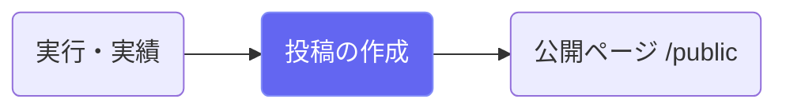
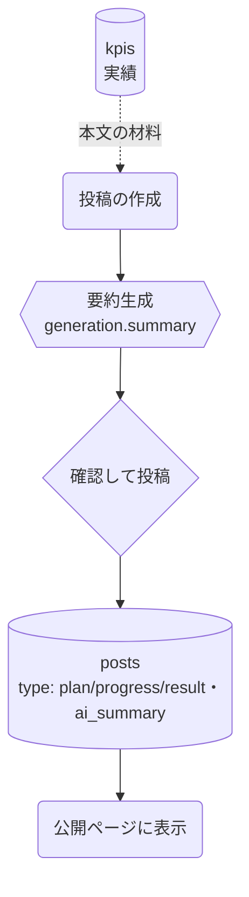

# 投稿（住民向け公開報告）

## ① このメニューは何をするか

計画の進捗を住民向けに発信する投稿（計画/進捗/成果の3タイプ）を作成します。
AIが本文から**平易な要約**を生成し、公開ページ（/public/自治体スラッグ）に表示されます。
※ サイドバーの表示名は「AI改善提案」ですが、実体はこの投稿機能です。

## ② 位置づけ

## ③ データフロー

## ⑤ 操作手順

1. 投稿タイプ（計画/進捗/成果）を選んで本文を書く
2. 「AI要約」で住民向けの平易な要約を生成（確認して採用）
3. 投稿 — 公開ページに表示される（公開範囲に注意）

## ⑦ 実装メモ

- 関連する実装記録: `claude/coe-govlink.md`

## ⑧ 更新履歴

- 2026-08-26 v1 — M3 初版
