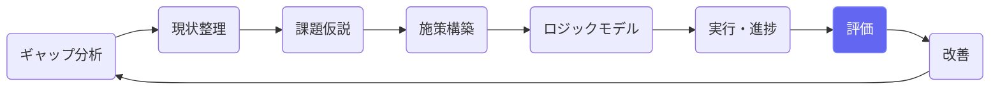
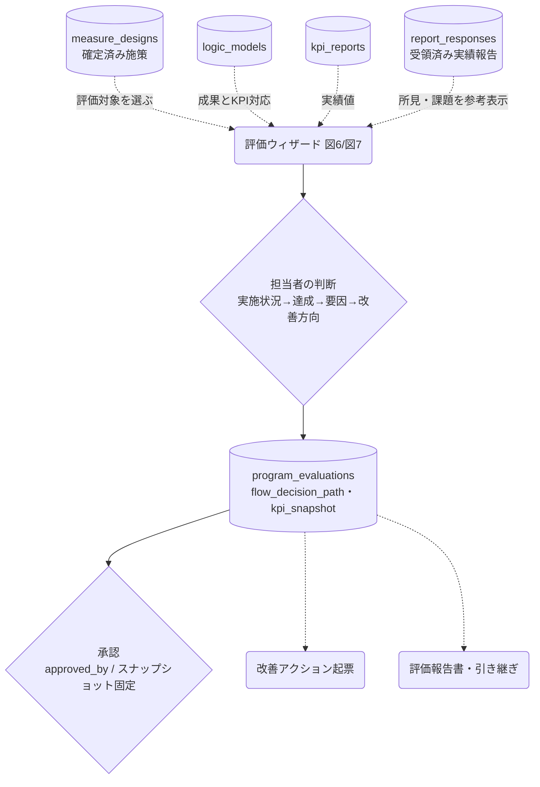

# プログラム評価

## ① このメニューは何をするか

介護保険事業計画策定方針の2つの評価フロー — **図6（取組毎・年次評価）**と
**図7（主要施策毎・計画期間評価）** — を分岐ウィザードで実施します。
通った判断経路がそのまま記録され、「なぜこの判断に至ったか」の説明責任が残ります。

## ② 位置づけ

## ③ データフロー

## ④ 状態

評価レコード: draft →（レビュー）→ approved。承認時に **kpi_snapshot を固定**し、
以後の実績更新に影響されません（監査可能性）。

## ⑤ 操作手順

1. フローを選ぶ — 図6（短期アウトカム・年2回）/ 図7（中間アウトカム・計画期間内1回）
2. **評価する施策を選ぶ**（推奨 — KPI・SPO指標・実験設計・効率性の算定式が一度に決まる）。
   受領済み実績報告があれば、その施策の所見・課題が参考表示される
3. ウィザードの設問に沿って判断（達成の自動判定は到達度の統一計算 — 確認して上書き可）
4. 保存 → 評価一覧で確認 → 承認（スナップショット固定）
5. 未達なら「改善アクション起票」へ（評価との紐付きが記録される）

## ⑥ 用語と判定基準

- **到達度**: (現在値 − 基準値) ÷ (目標値 − 基準値) × 100（目標の向きを考慮・全画面統一計算）
- **効率性評価（第5階層）**: 成果1単位あたり費用（F区画の算定式）— cost tier の評価で記録
- **rollup**: KPI階層（contributes_to）に沿って下位KPIの寄与を集計する参考表示

## ⑦ 実装メモ

- テーブル: program_evaluations（flow_decision_path JSONB＝判断経路の記録）
- フロー定義の正本: `src/lib/evaluation/flow.ts`（フロー改訂はこのファイルで完結）
- 関連する実装記録: `claude/coe-ca-p1.md`〜`coe-ca-p3.md`・`claude/coe-s2.md`（実績報告の参考表示）

## ⑧ 更新履歴

- 2026-08-26 v1 — M2 初版（S2 実績報告の参考表示を反映）
