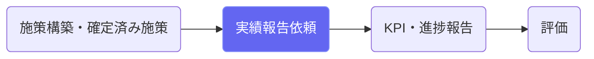
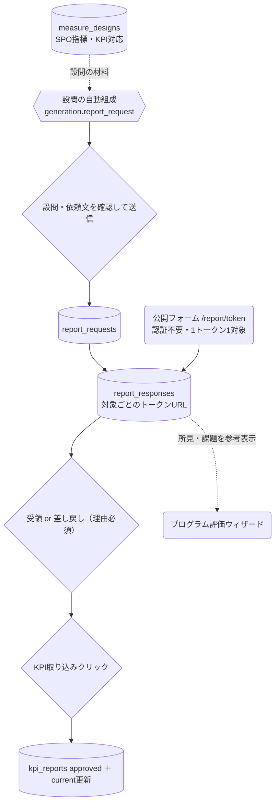

# 実績報告依頼

## ① このメニューは何をするか

施策の担当課・**委託事業者などの外部関係者**に実績報告を依頼し、
**ログイン不要のトークンURLフォーム**で回答を回収します。
受領した回答のKPI実績値はワンクリックでKPI報告に取り込めます（二重入力の排除）。

## ② 位置づけ

## ③ データフロー

## ④ 状態

依頼: draft →（送信=URL発行・設問固定）→ sent →（締切）→ closed（再開可）。
回答: pending → answered →（受領）accepted ／（差し戻し）returned → 再回答。
受領後はフォーム固定・KPI取り込みは受領済みのみ・二重取り込みは拒否。

## ⑤ 操作手順

1. 「＋依頼を作成」— 種別（年次/計画期間）・年度・期限・対象施策を選ぶと設問をAIが組成
2. 設問・依頼文を確認・編集 → 「📮 送信」で対象ごとの回答URLを発行
3. URLをコピーして担当者・事業者に共有（メール等）。未回答には「⏰督促記録」。
   庁内のLiberaユーザーには「📱 Liberaで通知」— 未回答・差し戻し中の回答URLが
   送信先（スケジュール画面のLibera連携で登録）のLiberaタスクとして届く
4. 回答を確認して「✅受領」または「🔁差し戻し」（理由は回答者に表示される）
5. 受領後「📊 KPI実績値を取り込む」— KPI報告に登録され現在値が更新される

## ⑥ 用語と判定基準

- **1トークン1対象**: 回答URLは施策×依頼ごとに固有。締切・失効で無効化できる
- **取り込み対象**: kpi_id つき数値設問への数値回答のみ（文字は流れない）

## ⑦ 実装メモ

- 正本: `src/lib/report/types.ts`（設問・回答のサニタイズ） ／ 検査: check:report
- メール送信は未実装 — URLは画面からコピーして共有する運用
- 関連する実装記録: `claude/coe-s2.md`

## ⑧ 更新履歴

- 2026-08-26 v1 — M3 初版
- 2026-08-26 v2 — S3（Liberaタスク通知）を追記
