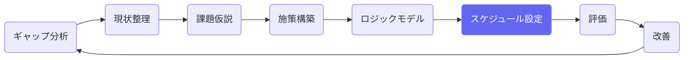
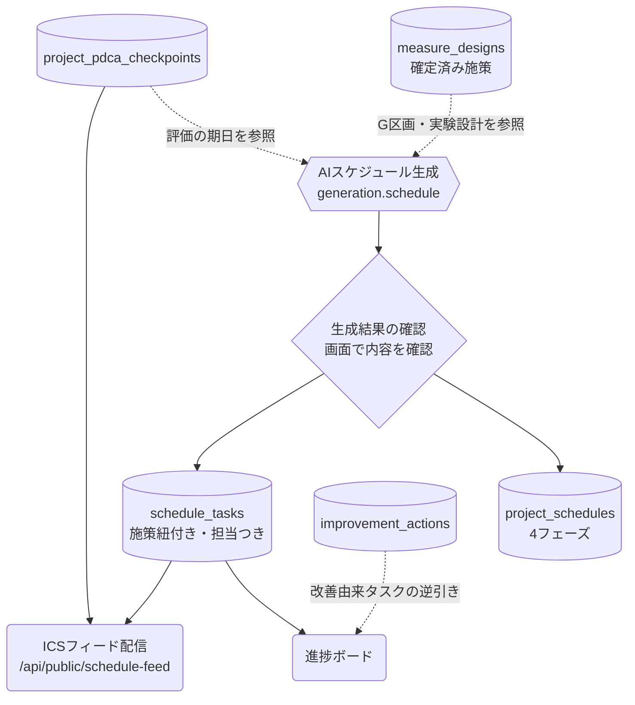

# スケジュール設定

## ① このメニューは何をするか

計画全体の年間工程表を AI で一括生成し、タスクの進捗（完了・期限超過）を
施策別の進捗ボードで管理します。工程表は ICS フィードで
Google / Outlook / Libera のカレンダーに購読配信できます。

## ② 位置づけ

施策構築（EBPM）で**確定した施策**の実行計画を工程に落とす場所です。
ここで管理する期限・完了状況が、KPI・進捗報告と評価の前提になります。

## ③ データフロー

AI 生成は**ゲートウェイ経由（taskType: generation.schedule）**です。
生成し直すと既存の工程表は置き換わります（タスクの完了記録も消えるため、
運用開始後の再生成は慎重に）。

## ④ 状態

- タスク: 未着手 →（完了ボタン）→ 完了。期限を過ぎた未完了は**期限超過**として赤表示
- フェーズ: 未着手 / 進行中 / 完了（手動切替)
- ICSフィードトークン: 有効 →（失効ボタン）→ 失効（配布先ごとに止められる）

## ⑤ 操作手順

1. **生成** — 計画開始日・終了日を入れて「AIでスケジュールを生成」。
   施策構築で施策を**確定**してから生成すると、施策ごとのタスク群
   （マイルストーン・実験の測定時期を含む）が担当課つきで並びます。
2. **進捗ボード** — 完了 / 期限超過 / 未着手の件数、チェックポイント完了率、
   施策別×四半期（年度区切り: Q1=4〜6月）の一覧。🔧 は改善アクション由来のタスクです。
3. **実績記入** — タスク一覧の「完了」ボタンで完了記録（「戻す」で取り消し）。
4. **カレンダー連携** — 「📆 カレンダー連携」でフィードURLを発行し、
   配布先のカレンダーに「URLで追加（購読）」。更新は自動反映されます。
   不要になった配布先は「失効」で止めます（URLを知っていても見られなくなります）。

## ⑥ 用語と判定基準

- **期限超過**: 期限日を過ぎて未完了のタスク（完了済み・期限なしは対象外）
- **チェックポイント完了率**: PDCAチェックポイントの completed ÷ 全体（skipped除外）。
  計画期間の経過率（日数）と並べて表示し、時間だけ過ぎて節目が消化できていない
  ずれを見えるようにしています
- **年度四半期**: Q1=4〜6月・Q2=7〜9月・Q3=10〜12月・Q4=1〜3月

## ⑦ 実装メモ

- テーブル: project_schedules（フェーズ）/ schedule_tasks（タスク。052で
  measure_design_id・owner_department を追加）/ schedule_feed_tokens（ICSトークン）
- 進捗計算の正本: `src/lib/schedule/board.ts` ／ ICSの正本: `src/lib/schedule/ics.ts`
- 検査: `npm run check:schedule`（ICSの折返し・エスケープ・四半期計算・配線）
- 関連する実装記録: `claude/coe-s1.md`

## ⑧ 更新履歴

- 2026-08-26 v1 — S1（実データ接続生成・進捗ボード・ICSフィード）を反映して新規作成
