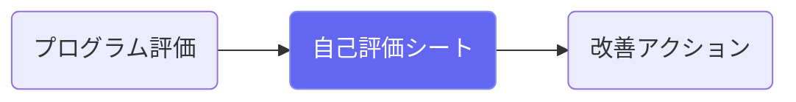
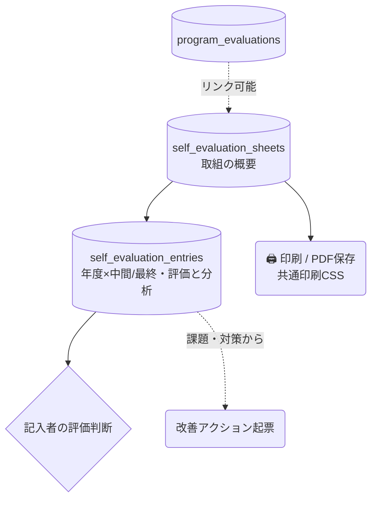

# 自己評価シート

## ① このメニューは何をするか

都道府県報告等で使う自己評価シート（取組概要＋年度ごとの中間/最終評価）を作成します。
**印刷 / PDF保存**はブラウザ印刷方式（「送信先: PDFに保存」で日本語のままPDF化）。

## ② 位置づけ

## ③ データフロー

## ④ 状態

エントリは年度×期別（interim/final）で1件。評価（achieved/mostly_achieved/…）は記入者の判断。

## ⑤ 操作手順

1. シートを作成（背景・取組内容・目標と指標・評価方法）
2. 年度ごとに中間・最終の評価を記入（実施内容・達成分析・課題・対策・次年度の変更）
3. 「印刷 / PDF保存」— 印刷画面で「送信先: PDFに保存」を選ぶ

## ⑦ 実装メモ

- 印刷は共通CSS（`src/lib/print/printCss.ts` — 評価報告書と共用。jsPDFの文字化け対策）
- 関連する実装記録: `claude/coe-selfeval-fix.md`・`claude/coe-pl3.md`（共通CSS化）

## ⑧ 更新履歴

- 2026-08-26 v1 — M3 初版
