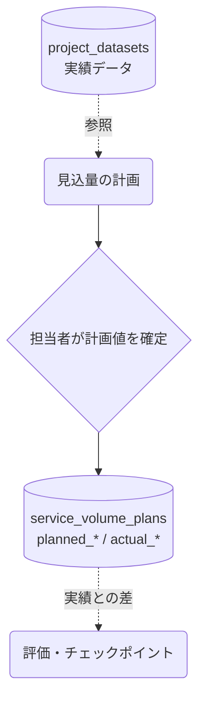

# サービス見込量

## ① このメニューは何をするか

サービスごと・年度ごとの見込量（認定率・受給率・利用者数・給付費など）を計画し、
実績と比較します。介護保険事業計画等の「見込量の設定と検証」に対応する画面です。

## ② 位置づけ

## ③ データフロー

## ⑤ 操作手順

1. サービス・年度ごとに見込量（認定率・受給率・単価・利用者数・給付費）を入力
2. 実績が入ったら計画対比を確認（チェックポイントの検証材料になる）

## ⑥ 用語と判定基準

- **見込量**: planned_*（計画値）と actual_*（実績値）の対で管理

## ⑦ 実装メモ

- テーブル: service_volume_plans（checkpoint_id で節目に紐付け可能）
- 関連する実装記録: `claude/coe-govlink.md`

## ⑧ 更新履歴

- 2026-08-26 v1 — M3 初版
