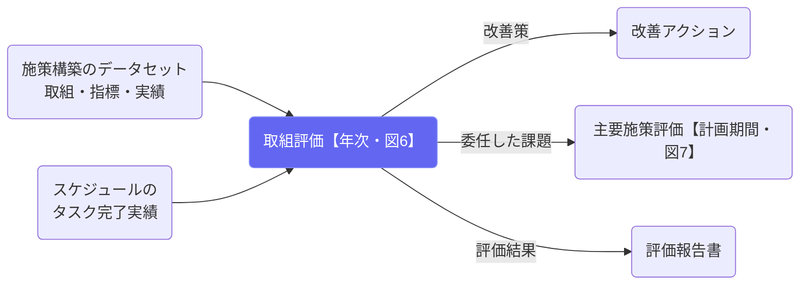

# 取組評価（年次）

## ① このメニューは何をするか

主要施策の下にある**取組（W-1…）**ごとに、**担当者レベルの年次評価（図6）**を回します。
評価の目的は2つです。

1. **次年度以降の取組の効果性向上** — 初期アウトカム指標の改善につながる、取組レベルの
   改善策を決めます。
2. **上位への委任** — 取組の改善だけでは解消できない課題（主要施策レベルの包括的な
   見直しが要るもの）を明らかにし、**主要施策毎評価（計画期間評価）へ委任**します。

あわせて、判定に使った指標と実績はスナップショットとして凍結され、評価報告書と
エビデンスの材料になります（アカウンタビリティの確保）。

## ② 位置づけ

## ③ 評価の流れ（図6）

1. **実績の確認** — 当該年度の指標実績が未入力ならその場で記入できます。
   No.5（アクティビティ）は**タスク完了実績からの自動集計**で、手入力は不要です。
2. **設問** — 体制（No.4）→ 実施状況（No.5・自動提示）→ 到達と質（No.10・11）→
   取組結果（No.6・自動提示）→ 初期アウトカム（No.7・自動提示）→ 取組への帰属
   （No.13・実験設計。比較データ未取得なら**暫定P判定**を選べます）→ 年次コスト
   （No.3・15・年度別事業費）→ 次年度の扱い → 改善策 → **上位への委任**。
   指標が設定されていない工程は自動でスキップされます。
3. **保存と承認** — 保存は下書き。**承認すると**判定に使った指標実績が凍結され、
   No.5 の実施率が実績として確定し、該当年度の評価系PDCAチェックポイントが
   自動で完了します。承認後の数字は、後からタスクや実績を触っても動きません。

## ④ よくある質問

- **システム判定と実態が違う** — 選び直せます。上書きした事実も記録に残ります
  （なぜその判断をしたかの説明責任）。
- **実施率が「計画にタスクなし」になる** — 施策構築のデータセットで実施項目に
  期限・繰り返しが入っているか確認してください。分母はスケジュール反映と同じ
  展開計算で数えています。
- **委任した課題はどこへ行くか** — 主要施策毎評価の冒頭に一覧で出て、
  そこで「扱った／次期計画へ引き継ぐ」が記録されます。
