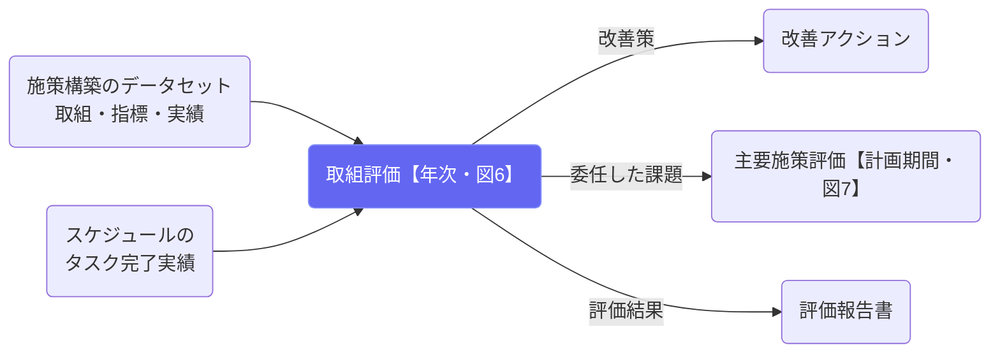

# 取組評価（年次）

## ① このメニューは何をするか

主要施策の下にある**取組（W-1…）**ごとに、**担当者レベルの年次評価（図6）**を回します。
評価の目的は2つです。

1. **次年度以降の取組の効果性向上** — 初期アウトカム指標の改善につながる、取組レベルの
   改善策を決めます。
2. **上位への委任** — 取組の改善だけでは解消できない課題（主要施策レベルの包括的な
   見直しが要るもの）を明らかにし、**主要施策毎評価（計画期間評価）へ委任**します。

あわせて、判定に使った指標と実績はスナップショットとして凍結され、評価報告書と
エビデンスの材料になります（アカウンタビリティの確保）。

## ② 位置づけ

## ③ フロー全体図（図6）

  
この評価の目的

  <ol>
    <li><b>次年度以降の取組の効果性を上げる</b> — 初期アウトカム指標の改善につながる、取組レベルの改善策を決める</li>
    <li><b>上位の評価へ委任する</b> — 取組の改善だけでは解消できない課題を明らかにし、主要施策評価へ渡す</li>
    <li><b>エビデンスを獲得し記録に残す</b> — 判定に使った指標と実績を凍結し、報告書とコーパスの材料にする</li>
  </ol>

  

工程 0 ／ 実施体制No.4 があるとき

    
実施に必要な体制は整っていましたか？

    
ストラクチャー指標（No.4）。体制の不備を、工程1の実施不振と切り分けて記録します。

  
↓

  

工程 1 ／ 実施状況自動提示

    
計画した取組は、予定どおり実施できましたか？

    
アクティビティ指標（No.5）＝ タスク完了実績 ÷ 当該年度の計画件数。分母はスケジュール反映と同じ展開計算で数えます。

  

<b>予定どおり</b>次へ

<b>一部・できなかった</b>要因を記述してから次へ

  
↓

  

工程 2b ／ 到達と質No.10・11 があるとき

    
届くべき人に、設計どおりの質で届きましたか？

    
カバレッジ・到達度（No.10）と実施品質・忠実度（No.11）。

  
↓

  

工程 2 ／ 取組結果自動提示

    
取組結果（アウトプット）は目標値に達しましたか？

    
アウトプット指標（No.6）の実績と目標値・達成条件から判定します。

  

<b>達した</b>次へ

<b>達していない</b>要因を選ぶ（活動量／リーチ／内容不適合／外部要因／指標設定）

  
↓

  

工程 3 ／ 初期アウトカム自動提示

    
初期アウトカム指標は目標値に達しましたか？

    
初期アウトカム指標（No.7）。アウトプットは出ているのに成果に結びつかない場合は、その仮説を残します。

  
↓

  

工程 4 ／ 取組への帰属

    
初期アウトカムの変化は、この取組の結果と言えますか？

    
インパクト指標（No.13）と実験設計（比較の作り方・不採用手法の記録・前提の確かめ方）を材料に判断します。<b>比較データが未取得なら「暫定P判定」</b>を選べます。

  
↓

  

工程 6 ／ 年次コスト

    
当該年度の投入は、実施状況と結果に見合っていましたか？

    
インプット指標（No.3・執行率）、単位コスト（No.15）、年度別の事業費と財源。

  
↓

  

結論 1 ／ 次年度の扱い改善へ

    
継続・拡充・縮小・変更・終了 ＋ 担当者レベルの改善策

    
改善策は改善アクションとして追跡できます。

  
↓

  

結論 2 ／ 上位への委任主要施策評価へ

    
取組の改善だけでは解消できない課題はありますか？

    
記入した課題は主要施策評価（図7）の入力になり、そこで「扱った／次期計画へ引き継ぐ」が記録されます。

## ④ 評価の流れ（図6）

1. **実績の確認** — 当該年度の指標実績が未入力ならその場で記入できます。
   No.5（アクティビティ）は**タスク完了実績からの自動集計**で、手入力は不要です。
1.5. **前提条件の確認（様式H2）** — 施策に前提条件表（施策構築のデータセット「前提条件表」）が
   あるときだけ出ます。前提ごとに「成立／崩れている」を確認方法に沿って記録します（不成立は
   確認した事実が必須）。**承認時に、崩れた前提ごとに改善アクション（出所: 前提条件の不成立）が
   自動起票**され、期末を待たず「崩れた場合の対応」を起動します。前提が無い施策では飛ばされます。
2. **設問** — 体制（No.4）→ 実施状況（No.5・自動提示）→ 到達と質（No.10・11）→
   取組結果（No.6・自動提示）→ 初期アウトカム（No.7・自動提示）→ 取組への帰属
   （No.13・実験設計。比較データ未取得なら**暫定P判定**を選べます）→ 年次コスト
   （No.3・15・年度別事業費）→ 次年度の扱い → 改善策 → **上位への委任**。
   指標が設定されていない工程は自動でスキップされます。
3. **保存と承認** — 保存は下書き。**承認すると**判定に使った指標実績が凍結され、
   No.5 の実施率が実績として確定し、該当年度の評価系PDCAチェックポイントが
   自動で完了します。承認後の数字は、後からタスクや実績を触っても動きません。

## ⑤ よくある質問

- **システム判定と実態が違う** — 選び直せます。上書きした事実も記録に残ります
  （なぜその判断をしたかの説明責任）。
- **実施率が「計画にタスクなし」になる** — 施策構築のデータセットで実施項目に
  期限・繰り返しが入っているか確認してください。分母はスケジュール反映と同じ
  展開計算で数えています。
- **委任した課題はどこへ行くか** — 主要施策毎評価の冒頭に一覧で出て、
  そこで「扱った／次期計画へ引き継ぐ」が記録されます。
- **前提条件の確認が出てこない** — その施策に前提条件表（H2）が未設定です。新設・移植・
  実行起因で再設計した施策には、施策構築のデータセットで 3〜5 項目を設定してください。
