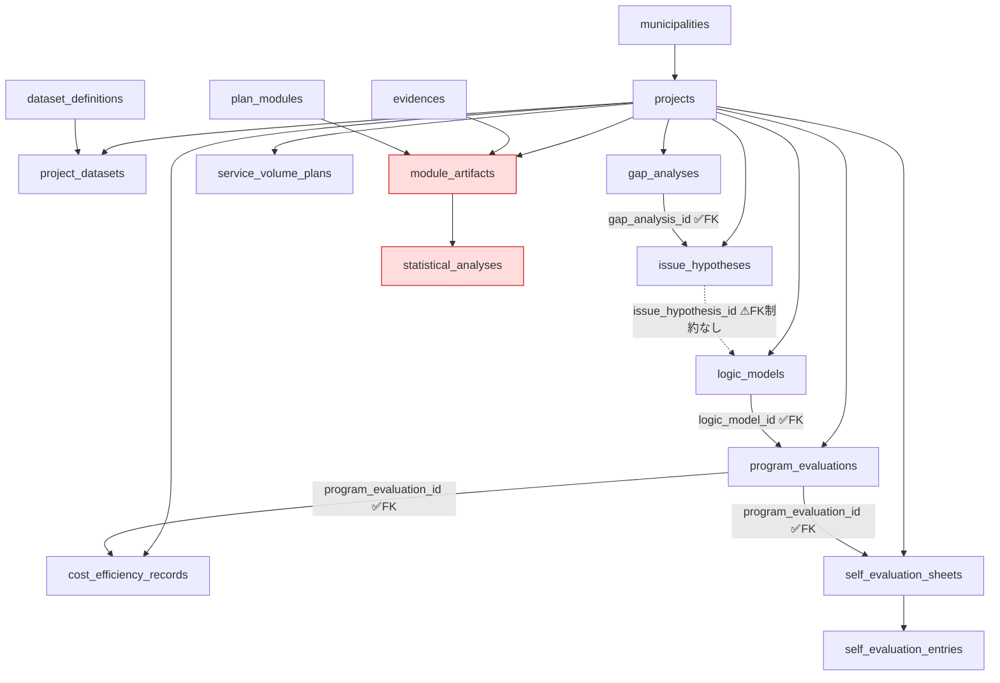

# GovLink AI — 現状棚卸しレポート（データ連携の分断調査）

> 作成日: 2026-05-31
> 目的: 度重なる方針変更により分断された可能性のある、モジュール間データ連携の現状把握
> 範囲: **調査・分析のみ。コード本体は一切修正していない。**
> 調査方法: `infra/migrations/*.sql`（DDL）および `app/src` 配下のソースコードを静的に解析。
> ※ 調査1のFK抽出SQLは稼働中DBへの接続が必要なため、ここでは全マイグレーション内の
> `REFERENCES` 句を抽出して同等の結果を再構成した（プログラム的にDB問い合わせした場合と同一）。

---

## 1. DBテーブル依存関係マップ

### 1-1. 外部キー（FK）一覧（親テーブル順）

DDLから抽出した実際の **FK制約** は以下のとおり。
（`logic_models.issue_hypothesis_id` など、ALTER で `REFERENCES` を付けずに追加された
「論理的な参照列」はFK制約が存在しないため、この一覧には**含まれない**。後述 §3・§4 参照。）

| 親テーブル | 子テーブル | FK列 |
|---|---|---|
| municipalities | projects | municipality_id |
| municipalities | org_resources | municipality_id |
| municipalities | reports | municipality_id |
| municipalities | plan_templates | shared_by_municipality_id |
| municipalities | user_roles | municipality_id |
| municipalities | subscriptions | municipality_id |
| municipalities | invoices | municipality_id |
| municipalities | usage_tracking | municipality_id |
| municipalities | org_units | municipality_id |
| municipalities | knowledge_documents | municipality_id |
| municipalities | knowledge_dicts | municipality_id |
| projects | kpis | project_id |
| projects | posts | project_id |
| projects | logic_models | project_id |
| projects | project_schedules | project_id |
| projects | schedule_tasks | project_id |
| projects | documents | project_id |
| projects | evidences | project_id |
| projects | policy_suggestions | project_id |
| projects | reports | project_id |
| projects | project_goals | project_id |
| projects | kpi_reports | project_id |
| projects | project_module_configs | project_id |
| projects | project_pdca_checkpoints | project_id |
| projects | gap_analyses | project_id |
| projects | issue_hypotheses | project_id |
| projects | program_evaluations | project_id |
| projects | cost_efficiency_records | project_id |
| projects | service_volume_plans | project_id |
| projects | self_evaluation_sheets | project_id |
| projects | project_datasets | project_id |
| projects | module_artifacts | project_id |
| projects | statistical_analyses | project_id |
| projects | role_project_permissions | project_id |
| projects | project_knowledge_links | project_id |
| projects (← 親) | projects.template_id, projects.goal_id | （projects自身が plan_templates / project_goals を参照） |
| plan_templates | template_kpi_suggestions | template_id |
| plan_templates | template_evaluation_schedules | template_id |
| plan_templates | pdca_cycle_defs | template_id |
| plan_templates | projects | template_id |
| project_goals | projects | goal_id |
| pdca_cycle_defs | pdca_checkpoint_defs | cycle_id |
| pdca_checkpoint_defs | project_pdca_checkpoints | checkpoint_def_id |
| project_pdca_checkpoints | gap_analyses | checkpoint_id |
| project_pdca_checkpoints | issue_hypotheses | checkpoint_id |
| project_pdca_checkpoints | program_evaluations | checkpoint_id |
| project_pdca_checkpoints | cost_efficiency_records | checkpoint_id |
| project_pdca_checkpoints | service_volume_plans | checkpoint_id |
| project_pdca_checkpoints | self_evaluation_sheets | checkpoint_id |
| project_pdca_checkpoints | module_artifacts | checkpoint_id |
| plan_modules | project_module_configs | module_id |
| plan_modules | module_artifacts | module_id |
| plan_modules | module_incompatibility_rules | module_a / module_b |
| gap_analyses | issue_hypotheses | **gap_analysis_id** ✅(FKあり) |
| logic_models | program_evaluations | **logic_model_id** ✅(FKあり) |
| program_evaluations | cost_efficiency_records | **program_evaluation_id** ✅(FKあり) |
| program_evaluations | self_evaluation_sheets | **program_evaluation_id** ✅(FKあり) |
| self_evaluation_sheets | self_evaluation_entries | sheet_id |
| dataset_definitions | project_datasets | dataset_def_id |
| evidences | module_artifacts | evidence_id |
| module_artifacts | statistical_analyses | artifact_id |
| kpis | evidences | output_kpi_id / outcome_kpi_id |
| kpis | benchmark_values | kpi_id |
| kpis | kpi_reports | kpi_id |
| documents | evidences | document_id |
| schedule_tasks | documents | schedule_task_id |
| project_schedules | schedule_tasks | schedule_id |
| subscriptions | invoices | subscription_id |
| org_units | org_units | parent_id（自己参照） |
| org_units | org_roles | org_unit_id |
| org_roles | user_org_memberships | org_role_id |
| org_roles | role_project_permissions | org_role_id |
| knowledge_documents | knowledge_document_sections | document_id |
| knowledge_dicts | knowledge_document_sections | dict_id |
| knowledge_dicts | project_knowledge_links | knowledge_dict_id |

### 1-2. 親子関係ツリー（主要系統）

```
municipalities
├── projects ★中心ハブ
│   ├── kpis ──┬── evidences (output_kpi_id / outcome_kpi_id)
│   │          ├── benchmark_values
│   │          └── kpi_reports
│   ├── posts
│   ├── project_datasets ── (dataset_definitions)
│   ├── logic_models
│   ├── project_pdca_checkpoints ── (pdca_checkpoint_defs ← pdca_cycle_defs ← plan_templates)
│   │   └── (各評価モジュールが checkpoint_id で参照)
│   ├── 【EBPM評価チェーン】
│   │   gap_analyses
│   │     └── issue_hypotheses (gap_analysis_id) ✅FK
│   │            ※ logic_models へは issue_hypothesis_id 列で接続（FKなし）⚠
│   │   logic_models
│   │     └── program_evaluations (logic_model_id) ✅FK
│   │            ├── cost_efficiency_records (program_evaluation_id) ✅FK
│   │            └── self_evaluation_sheets (program_evaluation_id) ✅FK
│   │                  └── self_evaluation_entries (sheet_id)
│   │   service_volume_plans （チェーンから独立。project_id/checkpoint_id のみ）
│   ├── module_artifacts ── statistical_analyses (artifact_id)  ※未使用（§3）
│   ├── project_module_configs ── (plan_modules)
│   ├── project_knowledge_links ── (knowledge_dicts)
│   ├── role_project_permissions ── (org_roles)
│   ├── documents ── evidences
│   ├── project_schedules ── schedule_tasks ── documents
│   ├── project_goals, policy_suggestions, reports
│   └── projects.template_id / goal_id（plan_templates / project_goals を逆参照）
├── plan_templates ── template_kpi_suggestions / template_evaluation_schedules / pdca_cycle_defs
├── org_units (自己参照) ── org_roles ── user_org_memberships / role_project_permissions
├── knowledge_documents ── knowledge_document_sections
├── knowledge_dicts ── knowledge_document_sections / project_knowledge_links
├── subscriptions ── invoices
├── usage_tracking, org_resources, user_roles
```

### 1-3. Mermaid（EBPM評価チェーン中心）



> **凡例:** 実線 ✅ = FK制約あり / 破線 ⚠ = 論理参照列のみ（FK制約なし） /
> 赤ノード = テーブルは存在するがアプリコードから書き込まれていない（§3）。

---

## 2. モジュール×テーブル対応表

各モジュールの API ルート・ページが実際に発行している SQL を確認して整理した。
「上流／下流」列は **設計（SPEC / CAUSAL_EDGES）上の想定**であり、実装の有無は §3・§4 で評価する。

| モジュール | READ するテーブル | WRITE するテーブル | 上流モジュール | 下流モジュール |
|---|---|---|---|---|
| **データセット管理**<br>(dataset_manager) | project_datasets, dataset_definitions | project_datasets（+ S3アップロード） | （なし） | gap_analysis, service_volume |
| **ギャップ分析**<br>(gap_analysis) | gap_analyses, **project_datasets**, dataset_definitions（ai-analyze）, knowledge_dicts | gap_analyses, statistical_analyses（stats/zscore・trend）| dataset_manager | issue_hypothesis |
| **課題仮説**<br>(issue_hypothesis) | issue_hypotheses | issue_hypotheses（`gap_analysis_id` は body から受領のみ）| gap_analysis | logic_model |
| **ロジックモデル**<br>(logic_model) | logic_models, knowledge_dicts（AI生成時）| logic_models（AI生成は DELETE→INSERT で全置換）| issue_hypothesis | program_evaluation |
| **プログラム評価**<br>(program_evaluation)<br>※API は `evaluations/` | program_evaluations | program_evaluations（`logic_model_id` は body から受領のみ）| logic_model | cost_efficiency, self_evaluation |
| **コスト効率**<br>(cost_efficiency) | cost_efficiency_records | cost_efficiency_records（`program_evaluation_id` は body から受領のみ）| logic_model（投入額）, program_evaluation（実績）| （なし） |
| **サービス見込量**<br>(service_volume) | service_volume_plans | service_volume_plans | dataset_manager | （なし／並列活動）|
| **自己評価**<br>(self_evaluation) | self_evaluation_sheets, self_evaluation_entries | self_evaluation_sheets, self_evaluation_entries（`program_evaluation_id` は body から受領のみ）| program_evaluation | （なし）|
| **ナレッジ管理**<br>(knowledge) | knowledge_documents, knowledge_dicts, knowledge_document_sections, project_knowledge_links | knowledge_documents, knowledge_dicts, knowledge_document_sections, project_knowledge_links（+ S3）| （独立）| 各AIモジュール（`getKnowledgeContext` 経由で gap_analysis / logic_model 等に注入）|
| **組織・権限**<br>(rbac) | org_units, org_roles, user_org_memberships, role_project_permissions, permission_audit_log, user_roles | org_units, org_roles, user_org_memberships, role_project_permissions, permission_audit_log | （独立）| **（設計上は全モジュールを統制すべきだが未連携 — §4）** |

補足:
- **ナレッジ管理は実際に下流連携している数少ない例。** `lib/knowledge-context.ts` の
  `getKnowledgeContext()` が `project_knowledge_links` + `knowledge_dicts`(Tier1/Tier2) を読み、
  `gap-analysis/ai-analyze` と `generate-logic-model` のAIプロンプトに注入している。
- **stats（zscore / trend）** は `statistical_analyses` に書き込むが、`artifact_id` は
  常に `null` 固定で挿入しており `module_artifacts` とは結び付いていない。

---

## 3. 成果物連鎖（アーティファクト・リネージ）の実装状況

### 3-1. `module_artifacts` テーブルの利用状況 → **実質ゼロ**

| 項目 | 状況 |
|---|---|
| テーブル定義 | ✅ 存在（ただし SPEC §2-A は `008_artifact_lineage.sql` を指定。実際は **`010_care_plan_suite.sql`** に統合されている＝ファイル名のドリフト）|
| `module_artifacts` への **INSERT/UPDATE** | ❌ **アプリコード内に存在しない**（`grep` 結果 0 件）|
| `source_artifact_ids` の書き込み | ❌ コード内に出現 0 件 |
| `artifact_record_id` の書き込み | ❌ コード内に出現 0 件 |
| `statistical_analyses.artifact_id` | ⚠ INSERT はあるが値は **常に `null`**（stats/zscore・trend）|
| `ArtifactLineagePanel.tsx` | ⚠ 存在するが props の `datasets` 配列を表示するだけ。`module_artifacts` を一切参照しない |
| lineage ページ (`projects/[id]/lineage`) | ⚠ `module_artifacts` ではなく **各テーブルのFK列を直接 JOIN** して系譜を再構成（`gap_analyses` / `issue_hypotheses.gap_analysis_id` / `logic_models.issue_hypothesis_id`）|

**結論:** 成果物レジストリ（`module_artifacts`）と陳腐化検出（`source_datasets_snapshot`）の仕組みは
**スキーマだけ存在し、書き込み側が一切実装されていない＝完全な空テーブル**。
リネージ表示UIは別ロジック（FK直結）で間に合わせており、SPEC §2-B/§2-C の設計とは乖離している。

### 3-2. `CAUSAL_EDGES`（causal-graph.ts）の実装状況

定義されている連携（7エッジ）と、実コードでの実装有無:

| # | CAUSAL_EDGE（from → to） | 実装手段 | 状態 |
|---|---|---|---|
| 1 | dataset_manager → gap_analysis | `gap-analysis/ai-analyze` が `project_datasets` を読んで `gap_analyses` を生成 | ✅ **実装済み**（データが実際に流れる）|
| 2 | gap_analysis → issue_hypothesis | `issue_hypotheses.gap_analysis_id`（FKあり）。ただし**値は手動指定**で、gap の中身を読んで仮説を生成する処理はない | △ **参照列のみ**（データフロー未実装）|
| 3 | issue_hypothesis → logic_model | `logic_models.issue_hypothesis_id`（**FK制約なしの列**）。AI生成 `generate-logic-model` は title/description/kpis のみ入力で、issue を読まない | ❌ **未実装**（列も未設定）|
| 4 | logic_model → program_evaluation | `program_evaluations.logic_model_id`（FKあり）。値は body から受領のみ | △ **参照列のみ** |
| 5 | program_evaluation → cost_efficiency | `cost_efficiency_records.program_evaluation_id`（FKあり）。値は body から受領のみ、実績の引き継ぎ計算なし | △ **参照列のみ** |
| 6 | program_evaluation → self_evaluation | `self_evaluation_sheets.program_evaluation_id`（FKあり）。値は body から受領のみ | △ **参照列のみ** |
| 7 | dataset_manager → service_volume | service_volume は `project_datasets` を読まない | ❌ **未実装** |

**さらに重大:** `CAUSAL_EDGES` / `checkModuleCompatibility` / `getDependencyChain`
（`lib/modules/causal-graph.ts`・`compatibility-checker.ts`）は
**どのページ・APIからも import されていない（自分自身以外で参照0件）＝デッドコード**。
モジュール選択画面の依存チェックは別系統（DBの `plan_modules.depends_on` と
`module_incompatibility_rules`）で実装されており、二重定義になっている。

---

## 4. データ連携の分断箇所リスト（優先度付き）

「設計（SPEC / CAUSAL_EDGES）では連携すべきだが、実コードでデータが流れていない」箇所を、
影響度の高い順に列挙する。

### 🔴 優先度 高（評価チェーンの根幹が切れている）

| ID | 分断箇所 | 設計上の想定 | 実装の現状 | 影響 |
|---|---|---|---|---|
| **H-1** | **issue_hypothesis → logic_model** | 課題仮説（problem/challenge/root_cause）をロジックモデル生成の入力にする | `generate-logic-model` は `title`/`description`/`kpis` だけで生成。`issue_hypothesis_id` 列はFK制約すら無く、AI生成時に未設定 | ロジックモデルが課題分析と無関係に生成され、EBPMの論理連鎖が成立しない |
| **H-2** | **logic_model（投入額）→ cost_efficiency** | ロジックモデルの inputs（投入資源）をコスト効率計算に渡す | cost-efficiency は `cost_efficiency_records` 単独。logic_models を読まない | コスト効率が手入力依存、ロジックモデルとの整合が取れない |
| **H-3** | **program_evaluation（実績）→ cost_efficiency（事後評価）** | プログラム評価の実績値を事後コスト効率（`cost_ratio_calc_ex_post`）に渡す | `program_evaluation_id` を受け取るのみ。実績を読んで事後計算する処理なし | 事前／事後コスト比較が機能しない |
| **H-4** | **module_artifacts 連鎖の全面未実装** | 全モジュールが成果物を `module_artifacts` に登録し、`source_artifact_ids` で上流を辿る | 書き込み 0 件・空テーブル。陳腐化検出（`source_datasets_snapshot`）も動かない | SPEC §2 の中核機能（リネージ・陳腐化警告）が全く動作しない |

### 🟠 優先度 中（参照列はあるがデータが流れない／整合性リスク）

| ID | 分断箇所 | 現状 | 影響 |
|---|---|---|---|
| **M-1** | gap_analysis → issue_hypothesis | `gap_analysis_id` は手動指定。gap の指標値を読んで仮説を提案する自動連携なし | 仮説とギャップの紐付けがユーザー任せ |
| **M-2** | logic_model → program_evaluation | `logic_model_id` を受領するのみ。評価対象の成果指標をロジックモデルから引き継がない | 評価設計が手入力依存 |
| **M-3** | program_evaluation → self_evaluation | 同上（`program_evaluation_id` 受領のみ）| 自己評価が評価実績と自動連動しない |
| **M-4** | `logic_models.issue_hypothesis_id` に **FK制約が無い** | ALTER で `REFERENCES` 無しに追加された論理列。孤児ID・型不整合を検出できない | 参照整合性が保証されず、リネージ再構成が壊れ得る |
| **M-5** | `statistical_analyses.artifact_id` が常に null | stats 結果が成果物に紐付かない | 統計分析が成果物連鎖から孤立 |

### 🟡 優先度 低（設計重複・デッドコード・ドリフト）

| ID | 箇所 | 現状 |
|---|---|---|
| **L-1** | `causal-graph.ts`（CAUSAL_EDGES / compatibility-checker）がデッドコード | どこからも import されず、依存チェックは DB の `plan_modules.depends_on` + `module_incompatibility_rules` で別実装。**依存定義が二重化** |
| **L-2** | SPEC §2-A のファイル名ドリフト | SPEC は `008_artifact_lineage.sql` を指定するが、実体は `010_care_plan_suite.sql` 内。`008` は billing。新規参加者が混乱 |
| **L-3** | `ArtifactLineagePanel.tsx` が設計と不一致 | SPEC §2-B は `module_artifacts` 再帰探索・陳腐化警告を要求するが、実装は datasets 一覧表示のみ |
| **L-4** | dataset_manager → service_volume 未連携 | CAUSAL_EDGES にあるが service_volume はデータセットを読まない |

### 🔴 横断的分断: RBAC がモジュール本体に未連携

| ID | 箇所 | 現状 | 影響 |
|---|---|---|---|
| **X-1** | **RBAC（role_project_permissions / getUserEffectivePermission）がモジュールAPIで未適用** | `getUserEffectivePermission` は permissions 設定画面・`permissions/check`・`auth.ts` でのみ使用。gap-analysis / logic-model / cost-efficiency 等の**データ操作APIは `getServerSession` のみで、プロジェクト別・モジュール別の権限チェックを一切行っていない** | 細粒度権限を設定しても実際のデータ読み書きには効かない＝権限機能が形骸化。セキュリティ／要件上の重大ギャップ |

---

## 5. 整理・改善の推奨事項

優先度と費用対効果を踏まえた推奨アクション。**本タスクでは未実施（提案のみ）。**

### A. 評価チェーンのデータフロー実装（最優先 / H-1〜H-3）
1. `generate-logic-model` に **issue_hypothesis を入力として渡す**よう改修し、生成時に
   `logic_models.issue_hypothesis_id` を必ずセットする。
2. cost-efficiency 作成/計算時に、紐づく `logic_models.inputs`（投入額）と
   `program_evaluations.result`（実績）を **サーバー側で読み込んでプリフィル／事前事後計算**する。
3. 各下流モジュールの GET で上流レコードを JOIN し、UI に「引き継いだ値」を提示する。

### B. 成果物連鎖の「実装するか/捨てるか」を意思決定（H-4 / M-5 / L-3）
- 方針A（活かす）: 各モジュールの WRITE 時に `module_artifacts` へ
  `artifact_record_id` + `source_artifact_ids` を登録する共通ヘルパ
  （例: `lib/modules/recordArtifact.ts`）を新設し、stats の `artifact_id` も埋める。
  `ArtifactLineagePanel` / lineage ページをこのテーブル基準に作り直す。
- 方針B（捨てる）: `module_artifacts` / `statistical_analyses.artifact_id` /
  `source_datasets_snapshot` を正式にスコープ外と決め、SPEC §2 を「FK直結方式」に書き換える。
  **現状は「中途半端に存在する空テーブル」が最も負債が大きいので、どちらかに倒すこと。**

### C. RBAC をモジュールAPIに接続（X-1 / セキュリティ）
- `lib/permissions.ts` の `getUserEffectivePermission` を使う
  `requireModulePermission(projectId, moduleId, level)` ガードを作り、
  各 `api/admin/projects/[id]/<module>/route.ts` の冒頭で呼ぶ。

### D. 参照整合性とコードの一貫性（M-4 / L-1 / L-2）
- `logic_models.issue_hypothesis_id` に
  `REFERENCES issue_hypotheses(id)` のFK制約を追加するマイグレーションを起こす。
- 依存グラフの**正本を1つに統一**する。DB（`plan_modules.depends_on` +
  `module_incompatibility_rules`）を正本とするなら `causal-graph.ts` を削除、
  TS定義を正本とするなら DB seed をそこから生成する。デッドコードのまま放置しない。
- SPEC §2-A のマイグレーションファイル名を実体（010）に合わせて修正、
  または注記を入れてドリフトを解消する。

### E. ドキュメント整備
- 本レポートの §2 対応表を `docs/integration_map.md` に取り込み、
  「設計上の連携」と「実装済みの連携」を明示的に区別した一枚表として維持する。

---

### 付録: 調査範囲メモ
- 解析対象: `infra/migrations/001〜013`、`app/src/app/api/**`、`app/src/app/(admin)/**`、
  `app/src/lib/{modules,permissions,knowledge-context}`、`app/src/components/lineage`。
- 「WRITE」は INSERT/UPDATE/DELETE を、「READ」は SELECT を発行しているテーブルを指す。
- 「△ 参照列のみ」= 外部キー列に値を保存できるが、上流レコードの内容を読んで
  下流の計算・生成に反映する処理が無い状態を指す。
